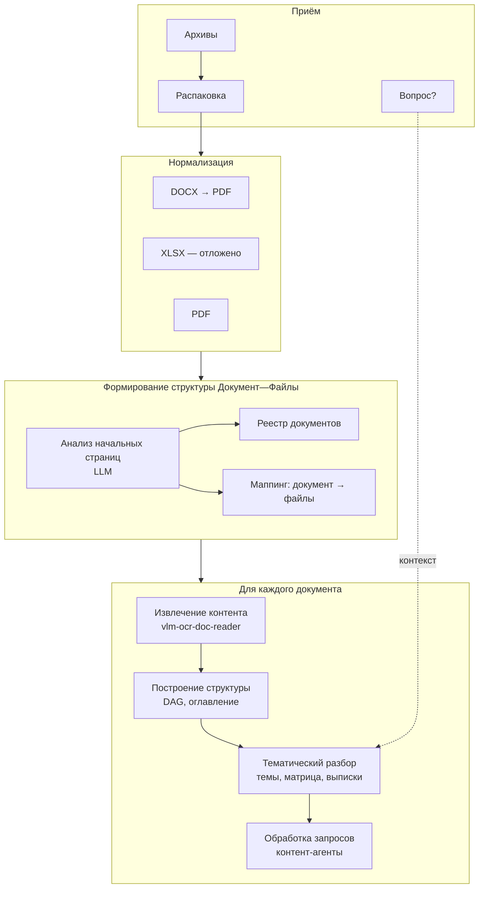
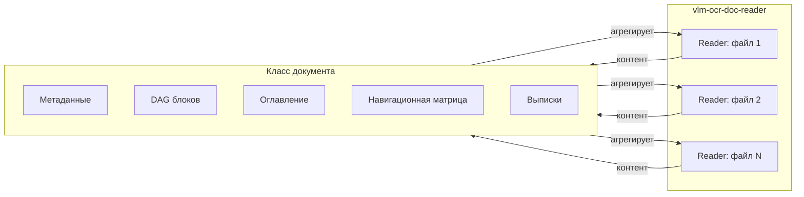
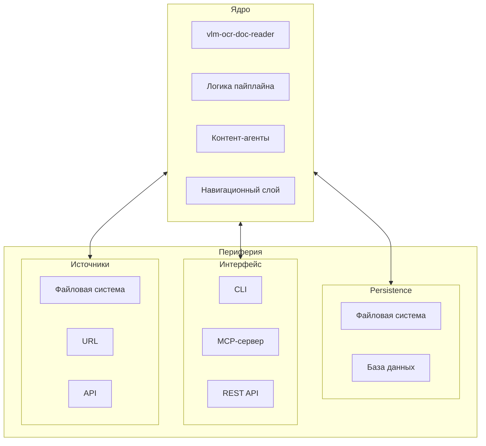

# Agentic Document Processing System
## Архитектурная модель. Уровень 1

**Версия:** 0.1  
**Дата:** 2026-01-29

---

## 1. Контексты использования

### 1.1. Локальный модуль

Первичный разбор документов с запуском через CLI. Конфигурационный файл задаёт параметры обработки и, опционально, вопросы для тематического разбора. Состояние хранится через файловую систему (JSON для технических параметров и метаданных, YAML для контента и выписок).

Назначение: тестирование пайплайнов, автономная работа.

### 1.2. Встраиваемый модуль

Подключение к другим сервисам для обработки потоков документов. Пример: сервис анализа существенных фактов о деятельности компаний, где по ссылкам скачиваются приложенные документы (решения советов директоров, отчётность), из которых извлекаются данные по запросу («Каково соотношение долга к EBITDA»).

Назначение: интеграция в пайплайны других систем.

### 1.3. Самостоятельный сервис / MCP-сервер

Работа через интерфейс (Open Web UI) или как MCP-сервер, подключённый к ассистентам. Кейс: формирование диаграмм и процессных описаний к большим регламентирующим документам — изучение содержания, интерпретация с точки зрения процессов, построение диаграмм.

Назначение: интерактивная работа с документами, итеративный диалог.

---

## 2. Ядро и периферия

Система разделяется на **ядро** (инвариантная логика обработки) и **периферию** (адаптеры к внешним условиям).

### 2.1. Ядро

Включает:
- vlm-ocr-doc-reader — работа с отдельными файлами
- Логика пайплайна обработки
- Контент-агенты
- Навигационный слой

### 2.2. Периферия

Варьируется в зависимости от контекста использования:
- Persistence layer (файлы / БД)
- Интерфейс взаимодействия (CLI / MCP / REST)
- Источники документов (файловая система / URL / API)

---

## 3. Пайплайн обработки

### 3.1. Приём

**Вход:** один или несколько архивов; опционально — вопрос/задание

**Действия:**
- Помещение в рабочую область
- Распаковка

**Артефакты:**
- Исходные архивы
- Распакованные файлы
- Вопрос (если передан)

### 3.2. Нормализация

**Действия:**
- DOCX → PDF (через GroupDocs / ConvertAPI)
- XLSX — отдельная механика (отложено)
- PDF — без изменений

**Артефакты:**
- PDF-версии всех файлов

### 3.3. Формирование структуры «Документ — Файлы»

**Действия:**
- Анализ начальных страниц файлов (титульные листы, заголовки, первые страницы) с участием LLM
- Группировка файлов по принадлежности к документам

**Артефакты:**
- Реестр документов
- Маппинг: документ → список файлов

### 3.4. Извлечение контента

*Выполняется для каждого документа*

**Действия:**
- Обработка через vlm-ocr-doc-reader (по одному экземпляру на файл)

**Артефакты:**
- PNG-файлы страниц (хранятся в vlm-ocr-doc-reader)
- Извлечённый контент (хранится в vlm-ocr-doc-reader)

### 3.5. Построение структуры документа

*Выполняется для каждого документа*

**Действия:**
- Построение DAG блоков
- Формирование оглавления с привязкой к страницам

**Артефакты:**
- DAG блоков документа
- Оглавление

### 3.6. Тематический разбор

*Выполняется для каждого документа*

**Действия:**
- Выделение тем (по шаблону, по запросу, или агентом-анализатором)
- Построение навигационной матрицы
- Формирование выписок

**Примечание:** если на этапе 3.1 передан вопрос, тематический разбор выполняется в контексте этого вопроса.

**Артефакты:**
- Список тем с описаниями
- Навигационная матрица (блоки × темы)
- Выписки

### 3.7. Обработка запросов

**Действия:**
- Работа контент-агентов
- Формирование ответов

**Артефакты:**
- Ответы на запросы
- История диалога
- Новые/дополненные выписки (при необходимости)

---

## 4. Артефакты: хранение

### 4.1. Императив

Сохранять все результаты обработки на любом этапе, чтобы избежать повторной обработки.

### 4.2. Обязательное хранение

| Артефакт | Место хранения |
|----------|----------------|
| PNG-файлы страниц | vlm-ocr-doc-reader |
| Извлечённый контент | vlm-ocr-doc-reader |
| Реестр документов, маппинг | Класс документа |
| DAG блоков, оглавление | Класс документа |
| Темы, навигационная матрица | Класс документа |
| Выписки | Класс документа |
| История диалога | Класс документа |

### 4.3. Опциональное хранение

| Артефакт | Условие |
|----------|---------|
| Исходные архивы | Для тестирования |
| Распакованные файлы | Для тестирования |
| Исходные PDF | Зависит от контекста использования |

---

## 5. Связь с vlm-ocr-doc-reader

- vlm-ocr-doc-reader работает с **файлом** (один экземпляр на файл)
- **Документ** может состоять из нескольких файлов
- «Класс документа» агрегирует несколько экземпляров vlm-ocr-doc-reader (по числу файлов в документе)

---

## 6. Диаграммы

### 6.1. Пайплайн обработки

### 6.2. Связь Документ — vlm-ocr-doc-reader

### 6.3. Ядро и периферия

---

## 7. Открытые вопросы

1. **Название «класса документа»** — требуется подобрать точный термин
2. **Обработка XLSX** — отдельная механика, требует проработки
3. **Детализация структуры «класса документа»** — отложено до следующего уровня
4. **Хранение контента на уровне документа** — нужно ли дублировать то, что хранит vlm-ocr-doc-reader
