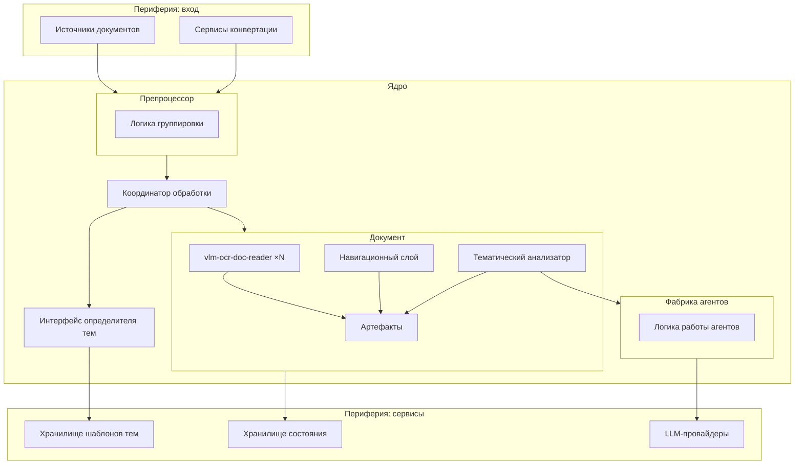
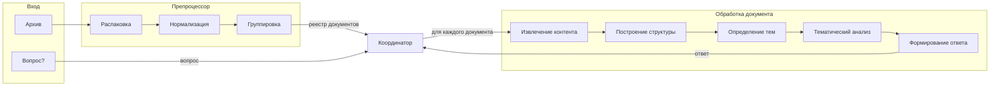
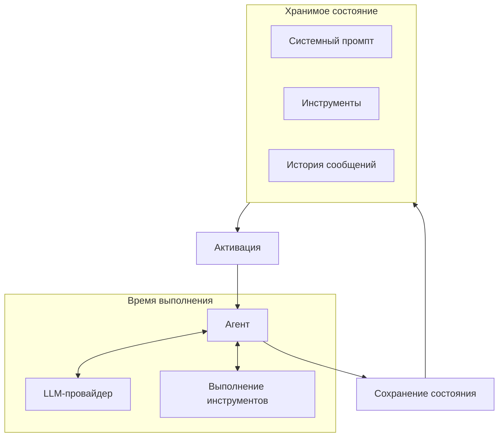
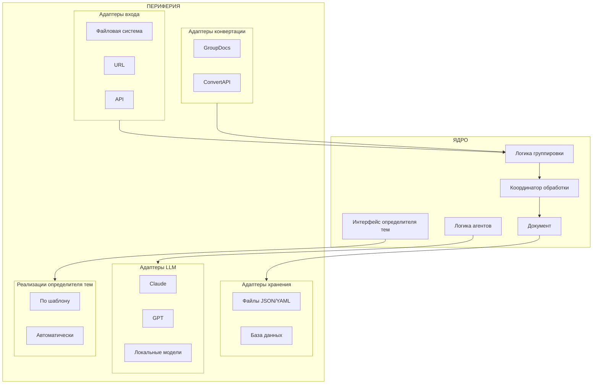

# Agentic Document Processing System
## Архитектурная модель. Уровень 2

**Версия:** 0.1  
**Дата:** 2026-01-29

---

## 1. MVP

**Формулировка:** архив + вопрос → полная обработка по пайплайну → ответ

Упрощений пайплайна для MVP не предусмотрено. Даже если вопрос выглядит простым, для ответа может потребоваться полная индексация, навигация и тематический разбор.

---

## 2. Оркестрация и контексты использования

Разница между контекстами использования — не в глубине обработки, а в **оркестрации**:

| Контекст | Паттерн | Оркестратор |
|----------|---------|-------------|
| Поток документов | один запрос → полная обработка → ответ | встроенный |
| Регламент | много запросов итеративно, каждый может породить тематический разбор | внешний (свой или Claude через MCP) |

**Вывод:** оркестрация — часть периферии, не ядра. Ядро выполняет этапы, а кто и как их координирует — зависит от контекста.

---

## 3. Компоненты системы

### 3.1. Препроцессор

**Ответственность:** приём, нормализация, группировка файлов по документам.

**Состав:**
- Адаптеры источников (файловая система, URL, API) — *периферия*
- Адаптеры конвертации (GroupDocs, ConvertAPI) — *периферия*
- Логика группировки файлов по документам (анализ начальных страниц с LLM) — *ядро*

**Выход:** реестр документов, маппинг документ → файлы.

### 3.2. Координатор обработки

**Ответственность:** запуск пайплайна по каждому документу, передача вопросов, сбор результатов.

**Относится к:** ядро.

**Примечание:** в MCP-сценарии внешний оркестратор (Claude) взаимодействует с координатором — передаёт вопросы, получает результаты.

### 3.3. Документ

**Ответственность:** 
- Агрегирует экземпляры vlm-ocr-doc-reader (по одному на файл)
- Хранит артефакты (DAG, оглавление, темы, матрица, выписки, история)
- Извлечение контента
- Построение структуры

**Относится к:** ядро.

**Включает:**
- **Навигационный слой** — оглавление, навигационная матрица, линкер. Работает с артефактами конкретного документа.
- **Тематический анализатор** — строит матрицу, формирует выписки по заданным темам.

### 3.4. Определитель тем

**Ответственность:** выделяет набор тем для тематического разбора.

**Режимы:**
- По шаблону (зависит от типа документа)
- По входящему вопросу
- Автоматически (LLM анализирует документ)

**Архитектурный статус:** интерфейс ядра с периферийными реализациями.

**Может отсутствовать.** Если нет шаблонов, нет вопросов и не подключён автоопределитель — документ прорабатывается по структуре и ожидает вопросов.

### 3.5. Контент-агенты (фабрика агентов)

**Ответственность:** инфраструктурный механизм для работы с контентом.

**Режимы работы:**
- **Extract** — извлечение информации из документа (используется тематическим анализатором)
- **Infer** — изложение, формирование ответов (используется при обработке запросов)

**Архитектурный статус:** переиспользуемый механизм, не привязан к конкретному этапу пайплайна.

**Модель существования агента:**
Агент — не обязательно постоянный экземпляр в памяти. Это хранимое состояние:
- Системный промпт
- Подключённые инструменты с описанием
- История сообщений

При необходимости на основе состояния агент активируется, отрабатывает, сохраняет состояние и «растворяется».

**Зависимости:**
- LLM-провайдеры — *периферия*
- Логика работы агента (циклы, инструменты, состояние) — *ядро*

---

## 4. Граница ядро / периферия

Граница проходит **внутри компонентов**, а не между ними.

### 4.1. Ядро

| Компонент/логика | Описание |
|------------------|----------|
| Координатор обработки | Управление пайплайном по документам |
| Документ | Агрегация, хранение артефактов, структура, навигация, тематический анализ |
| Логика группировки файлов | Часть препроцессора: анализ и группировка |
| Логика работы агентов | Фабрика агентов: циклы, инструменты, состояние |
| Интерфейс определителя тем | Контракт для получения тем |

### 4.2. Периферия (адаптеры)

| Адаптер | Описание |
|---------|----------|
| Источники документов | Файловая система, URL, API |
| Сервисы конвертации | GroupDocs, ConvertAPI |
| Хранилище состояния | Файлы (JSON/YAML) или БД |
| Хранилище шаблонов тем | Реализации определителя тем |
| LLM-провайдеры | Claude, GPT, локальные модели |

---

## 5. Диаграммы

### 5.1. Компоненты и их отношения

### 5.2. Потоки данных в пайплайне

### 5.3. Модель контент-агента

### 5.4. Граница ядро / периферия

---

## 6. Открытые вопросы

1. **Название «Документ» как компонента** — совпадает с концептуальным понятием, возможна путаница. Требуется ли другое название для компонента?

2. **Логика определения тем внутри ядра** — где именно: в координаторе или в документе? Пока не определено.

3. **Детализация фабрики агентов** — структура состояния, механизм активации, управление историей — требует проработки на следующем уровне.

4. **Обработка XLSX** — отложено, требует отдельной проработки.
