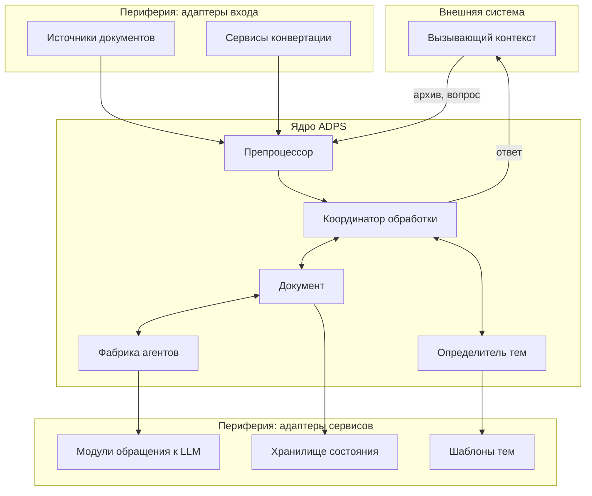
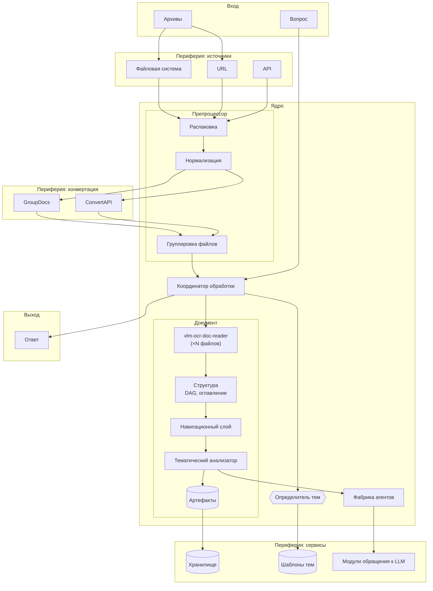
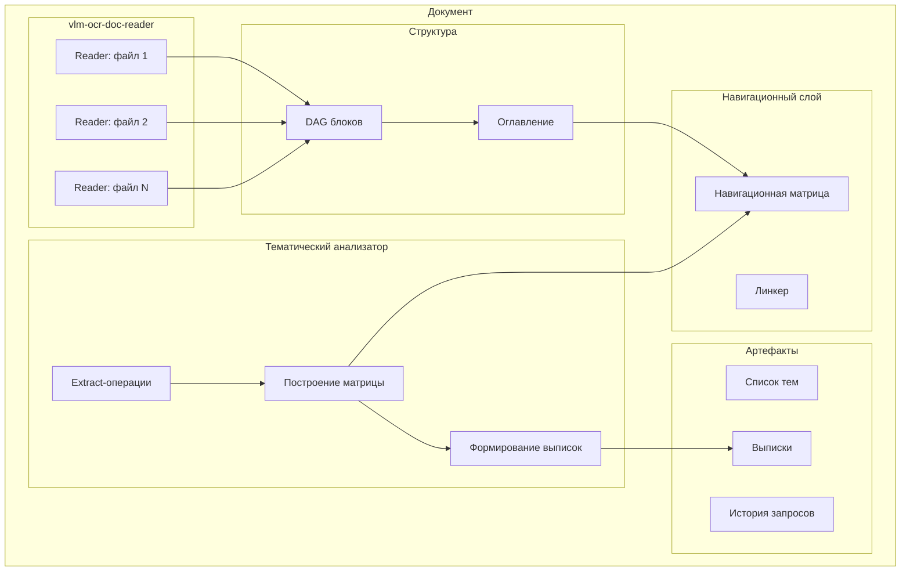
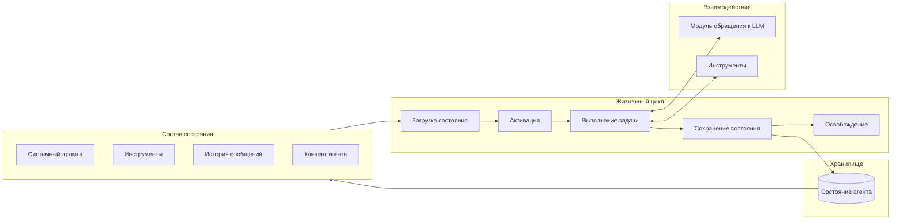
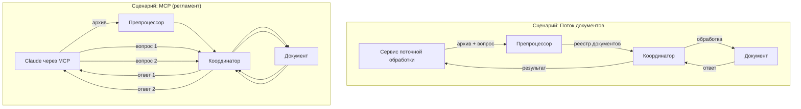

# Agentic Document Processing System
## Архитектурная модель. Уровень 2: Компоненты и границы

**Версия:** 0.3  
**Дата:** 2026-01-29

**Связанные документы:**
- Концептуальная модель (ADPS_Conceptual_Model.md)
- Архитектурная модель. Уровень 1 (ADPS_Architecture_L1.md)

---

## 1. Введение

### 1.1. Назначение документа

Документ описывает компонентную структуру системы ADPS, определяет границу между ядром и периферией, фиксирует MVP и принципы взаимодействия компонентов.

Документ предполагает знакомство читателя с:
- Концептуальной моделью ADPS (понятия: документ, файл, блок, тема, узел, выписка, контент-агент)
- Архитектурной моделью уровня 1 (пайплайн обработки из 7 этапов, артефакты, связь с vlm-ocr-doc-reader)

### 1.2. Краткое напоминание о пайплайне

Система обрабатывает документы по следующему пайплайну:

1. **Приём** — получение архивов, опционально вопроса
2. **Нормализация** — приведение файлов к PDF
3. **Группировка** — определение, какие файлы относятся к каким документам
4. **Извлечение контента** — обработка через vlm-ocr-doc-reader
5. **Построение структуры** — DAG блоков, оглавление
6. **Тематический разбор** — выделение тем, навигационная матрица, выписки
7. **Обработка запросов** — формирование ответов контент-агентами

---

## 2. MVP

### 2.1. Определение

**Минимально жизнеспособный продукт** — система, способная:
- Принять на вход архив с документами и вопрос к ним
- Выполнить полную обработку по всем этапам пайплайна
- Вернуть ответ на вопрос

### 2.2. Обоснование

Рассматривались варианты упрощения пайплайна для ускорения первой реализации. Однако анализ показал, что даже для «простых» вопросов может потребоваться полная индексация и тематический разбор: прямого ответа в документе может не быть, и для его формирования необходимо глубокое понимание структуры и содержания.

Поэтому MVP включает все этапы пайплайна без сокращений.

### 2.3. Приоритеты реализации

1. **Первый этап (ближайший месяц):** работа с потоком документов — автоматизированная обработка документов, поступающих из внешних источников, с извлечением данных по запросу
2. **Второй этап (через месяц):** работа с большими регламентами — итеративный многослойный анализ для извлечения процессов и построения диаграмм

---

## 3. Взаимодействие с внешними системами

### 3.1. Контексты использования

Система ADPS может использоваться в разных контекстах, которые определяют способ взаимодействия:

| Контекст | Паттерн взаимодействия | Внешняя система |
|----------|------------------------|-----------------|
| Поток документов | Один запрос → полная обработка → ответ | Сервис поточной обработки |
| Анализ регламента | Множество итеративных запросов, каждый может породить новый тематический разбор | MCP-клиент (например, Claude) или собственный сервис |

### 3.2. Принцип

ADPS — это модуль, который предоставляет операции для обработки документов. Логика управления (какие вопросы задавать, в какой последовательности, как интерпретировать результаты) находится во внешней системе, использующей данный модуль.

---

## 4. Компоненты системы

### 4.1. Обзор

### 4.2. Препроцессор

**Ответственность:**
- Приём входных данных (архивов)
- Распаковка
- Нормализация форматов (DOCX → PDF)
- Группировка файлов по документам

**Этапы пайплайна:** 1 (Приём), 2 (Нормализация), 3 (Группировка)

**Детали реализации:**

Группировка файлов по документам выполняется путём анализа начальных страниц (титульные листы, заголовки) с участием LLM. На этом этапе также определяется тип каждого документа, что может использоваться для последующего подбора шаблонов тематического разбора.

**Архитектурный статус:**

Препроцессор — не монолитный компонент. Внутри него:
- *Ядро:* логика группировки файлов по документам
- *Периферия:* адаптеры источников (файловая система, URL, API), адаптеры конвертации (GroupDocs, ConvertAPI)

**Выходные артефакты:**
- Реестр документов (включая определённый тип каждого документа)
- Маппинг: документ → список PDF-файлов

### 4.3. Координатор обработки

**Ответственность:**
- Получение реестра документов от препроцессора
- Запуск обработки по каждому документу
- Управление тематическим разбором (при наличии зарегистрированного модуля определения тем)
- Передача вопросов в документы
- Сбор и агрегация результатов

**Архитектурный статус:** ядро.

**Взаимодействие с внешним миром:**

Координатор — точка входа для внешних систем. Он принимает команды (обработать архив, задать вопрос), исполняет их и возвращает результаты. Координатор не определяет *стратегию* обработки — он *исполняет* команды, поступающие извне.

### 4.4. Документ

**Ответственность:**
- Агрегация экземпляров vlm-ocr-doc-reader (по одному на каждый файл документа)
- Извлечение контента из файлов
- Построение структуры (DAG блоков, оглавление)
- Хранение всех артефактов документа
- Навигация по контенту
- Тематический анализ
- Формирование краткого описания документа (по запросу)

**Этапы пайплайна:** 4 (Извлечение), 5 (Структура), 6 (Тематический разбор), 7 (Обработка запросов)

**Архитектурный статус:** ядро.

**Внутренняя структура:**

Компонент «Документ» включает:

**Навигационный слой** — обеспечивает поиск контента:
- Оглавление (структура с привязкой к страницам)
- Навигационная матрица (соответствие блоков и тем)
- Линкер (переходы между блоками/узлами)

**Тематический анализатор** — выполняет тематический разбор:
- Построение навигационной матрицы по заданным темам
- Формирование выписок
- Использует контент-агентов в режиме extract

**Хранимые артефакты:**
- DAG блоков документа
- Оглавление
- Список тем
- Навигационная матрица
- Выписки
- История запросов и ответов

### 4.5. Определитель тем

**Ответственность:** определение набора тем для тематического разбора документа.

**Режимы работы:**

| Режим | Описание | Входные данные |
|-------|----------|----------------|
| По шаблону | Набор тем определяется типом документа | Тип документа (из препроцессора) |
| Автоматически | LLM предлагает темы | Тип документа или краткое описание документа |

**Архитектурный статус:** интерфейс ядра с периферийными реализациями. Может отсутствовать.

**Сценарии работы:**

1. **Шаблонный разбор:** На этапе препроцессинга определяется тип документа. Координатор передаёт тип в библиотеку шаблонов, получает перечень тем, затем последовательно или параллельно опрашивает документ по каждой теме.

2. **Автоматический разбор (вариант А):** Координатор передаёт тип документа автоопределителю, тот «из общих соображений» формирует перечень тем.

3. **Автоматический разбор (вариант Б):** После построения структуры координатор запрашивает у документа краткое описание. Описание передаётся автоопределителю, тот возвращает перечень тем.

**Если определитель тем отсутствует:** документ обрабатывается до этапа построения структуры и ожидает поступления вопросов. Тематический разбор выполняется по мере поступления вопросов, в контексте каждого вопроса.

### 4.6. Фабрика агентов (контент-агенты)

**Ответственность:** предоставление механизма работы с контентом через LLM.

**Режимы работы агентов:**

| Режим | Назначение | Где используется |
|-------|-----------|------------------|
| Extract | Извлечение информации из исходного документа | Тематический анализатор (этап 6) |
| Infer | Формирование ответов на основе извлечённой информации | Обработка запросов (этап 7) |

**Архитектурный статус:** переиспользуемый механизм ядра.

**Модель существования агента:**

Контент-агент — не обязательно постоянно существующий объект в памяти. Агент представляет собой **хранимое состояние**:
- Системный промпт (инструкции агенту)
- Набор подключённых инструментов с описаниями
- История сообщений
- Контент, за который отвечает агент (блок документа или узел темы)

**Варианты подключения контента:**
- Включение непосредственно в системный промпт
- Добавление как сообщение в историю
- Получение через вызов отдельного tool (если контент не нужен до получения вопроса)

При необходимости выполнить работу:
1. Состояние загружается
2. Агент активируется
3. Агент выполняет задачу (взаимодействует с LLM, вызывает инструменты)
4. Состояние сохраняется
5. Агент «растворяется»

Такая модель позволяет:
- Экономить ресурсы (агент существует только во время работы)
- Сохранять контекст между сессиями
- Масштабировать количество агентов без ограничений памяти

**Зависимости:**
- *Ядро:* логика работы агента (циклы вызовов, обработка инструментов, управление состоянием)
- *Периферия:* модули обращения к LLM

---

## 5. Граница ядро / периферия

### 5.1. Принцип

Граница между ядром и периферией проходит **внутри компонентов**, а не между ними.

Компонент может содержать ядровую логику и использовать периферийные адаптеры. Это позволяет:
- Менять реализацию периферии без изменения ядра
- Тестировать ядро изолированно
- Адаптировать систему к разным контекстам использования

### 5.2. Состав ядра

| Элемент | Описание |
|---------|----------|
| Координатор обработки | Управление пайплайном, маршрутизация запросов |
| Документ | Агрегация файлов, хранение артефактов, навигация, тематический анализ |
| Логика группировки | Алгоритм определения принадлежности файлов к документам |
| Логика работы агентов | Циклы вызовов LLM, обработка инструментов, управление состоянием |
| Интерфейс определителя тем | Контракт для получения набора тем |

### 5.3. Состав периферии

| Элемент | Описание |
|---------|----------|
| Источники документов | Файловая система, URL, API |
| Сервисы конвертации | GroupDocs, ConvertAPI |
| Хранилище состояния | Файлы (JSON для метаданных, YAML для контента) или БД |
| Реализации определителя тем | По шаблону, автоматически (LLM). Может отсутствовать |
| Модули обращения к LLM | Обёртки над API провайдеров (Claude Haiku, GPT-5-mini, локальные модели). Содержат защитные механики: троттлинг, ретраи, обработку ошибок, управление лимитами |

---

## 6. Диаграммы

### 6.1. Компоненты и потоки данных

### 6.2. Внутренняя структура компонента «Документ»

### 6.3. Жизненный цикл контент-агента

### 6.4. Сценарии взаимодействия с внешними системами

---

## 7. Открытые вопросы

| # | Вопрос | Контекст |
|---|--------|----------|
| 1 | Название компонента «Документ» | Совпадает с концептуальным понятием, возможна путаница. Альтернативы: DocumentProcessor, DocumentContext, DocumentUnit |
| 2 | Структура состояния агента | Требует детализации: формат хранения, управление историей, ограничения на размер, способ подключения контента |
| 3 | Обработка XLSX | Отложено. Требует отдельной проработки механики работы с электронными таблицами |
| 4 | Навигация между документами | Если запрос требует данных из нескольких документов — кто это координирует? Координатор или отдельный механизм? |
