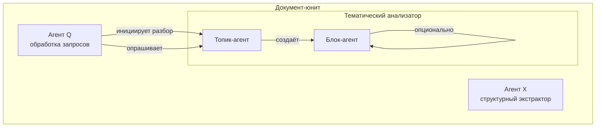
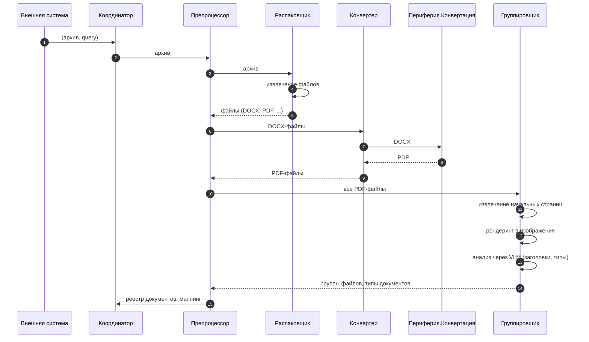
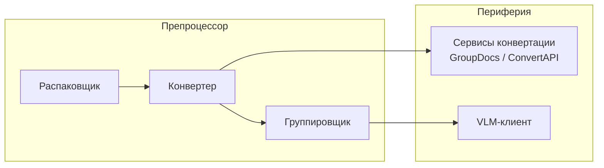
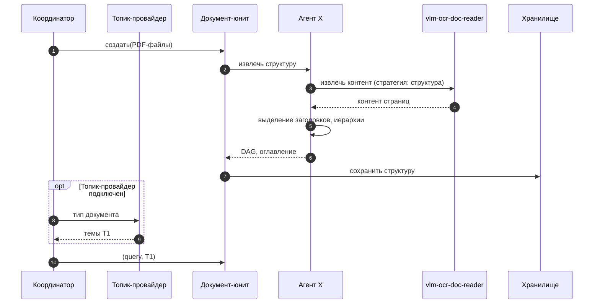
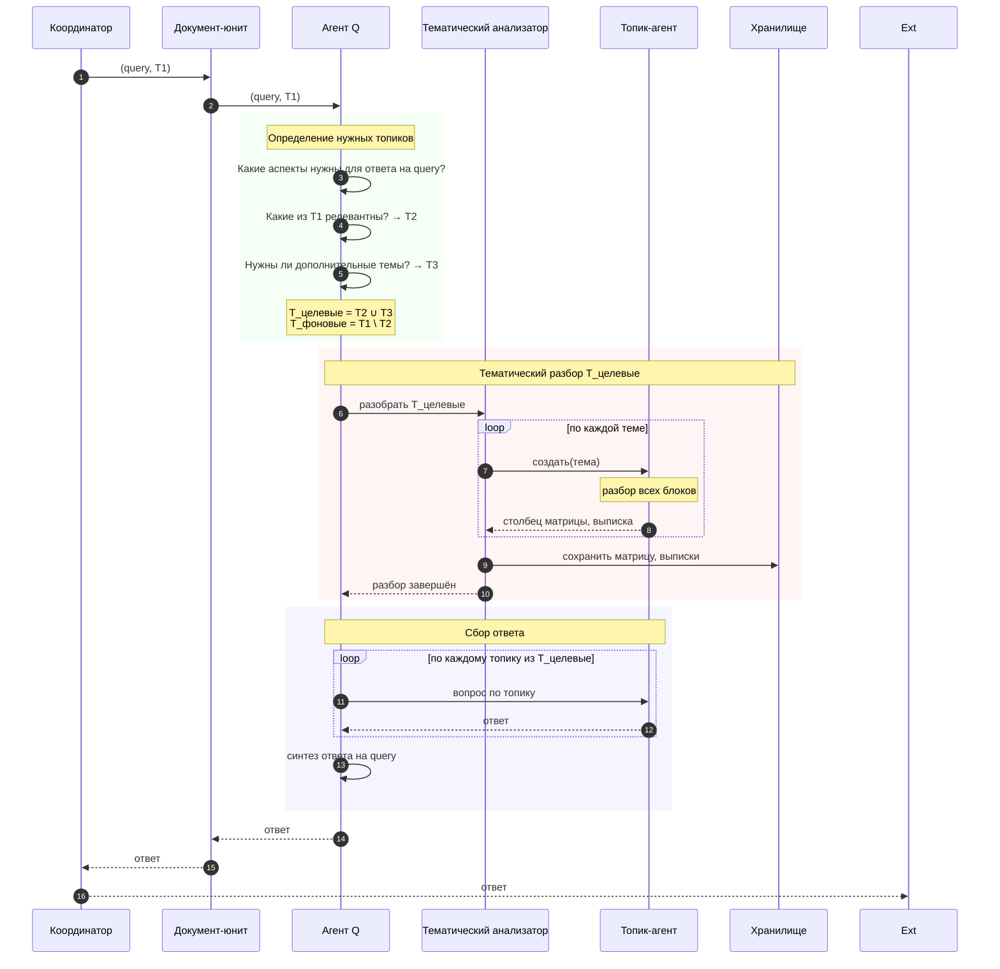
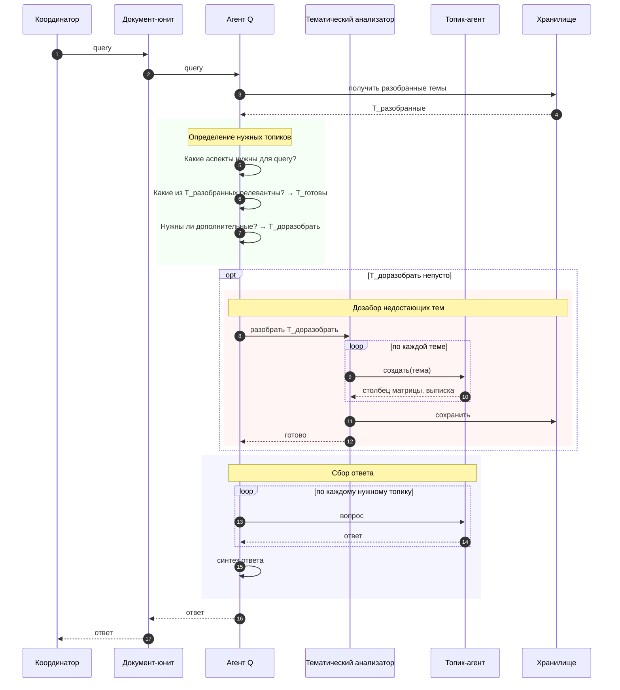
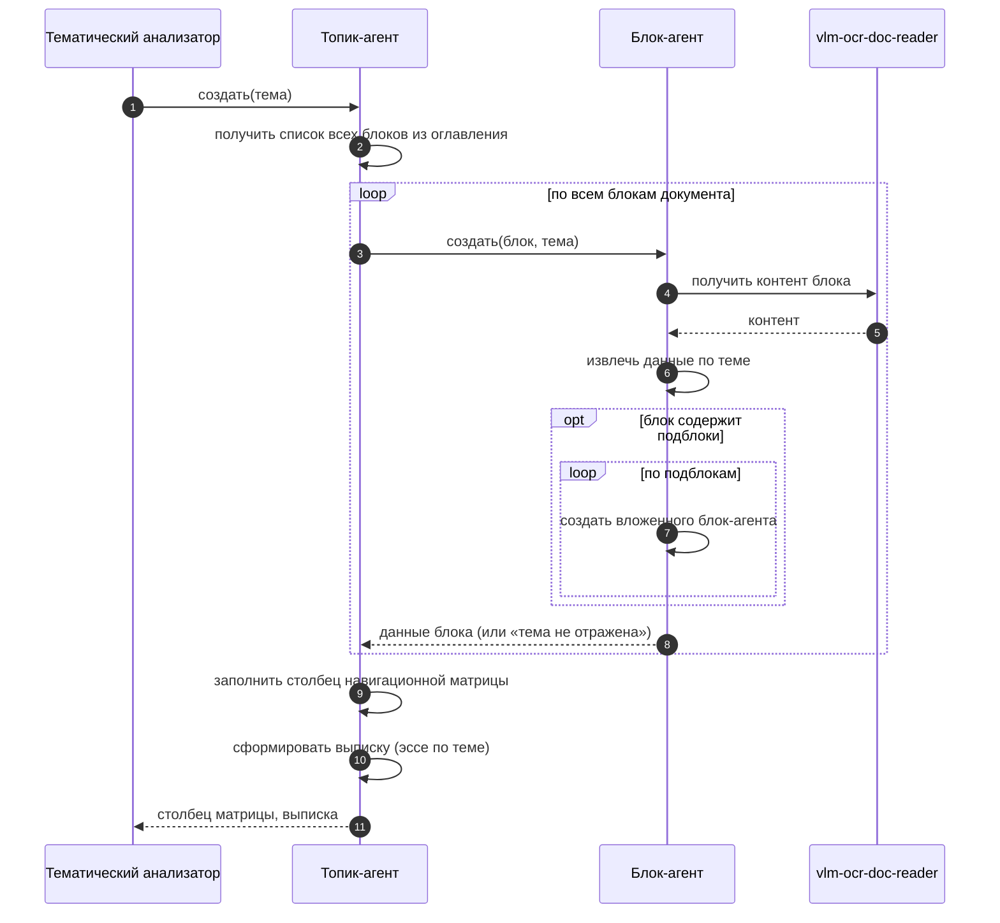
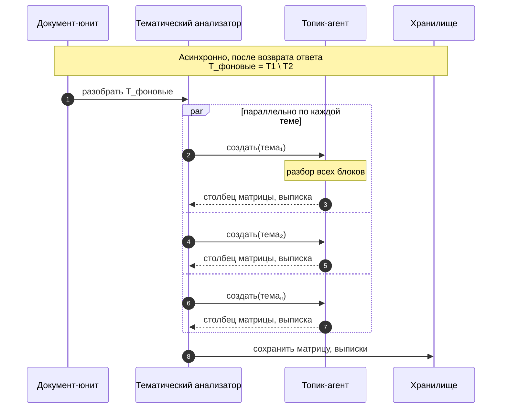
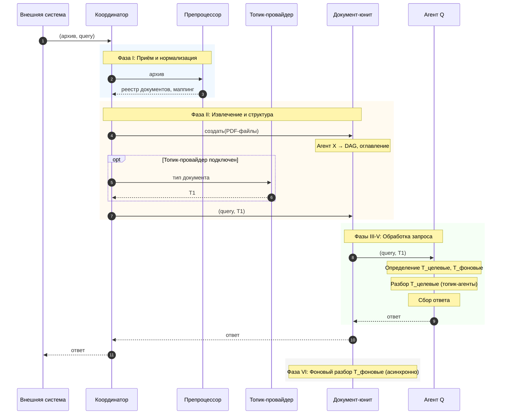
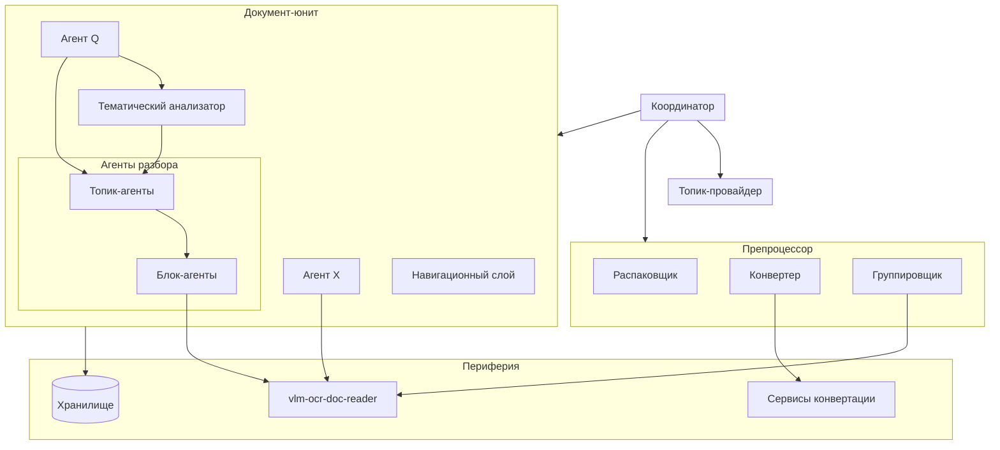

# Agentic Document Processing System
## Архитектурная модель. Уровень 3: Сквозные сценарии

**Версия:** 0.1  
**Дата:** 2026-01-29

**Связанные документы:**
- Концептуальная модель (ADPS_Conceptual_Model.md)
- Архитектурная модель. Уровень 1 (ADPS_Architecture_L1.md)
- Архитектурная модель. Уровень 2 (ADPS_Architecture_L2.md)

---

## 1. Введение

### 1.1. Назначение документа

Документ описывает сквозные сценарии работы системы ADPS — полный путь обработки от поступления архива до выдачи ответа. Сценарии верифицируют архитектуру, описанную в документах L1 и L2, и демонстрируют взаимодействие компонентов в динамике.

Документ предполагает знакомство читателя с:
- Концептуальной моделью ADPS (понятия: документ, файл, блок, тема/топик, узел, выписка, контент-агент)
- Архитектурной моделью L1 (пайплайн из 7 этапов, артефакты, ядро/периферия)
- Архитектурной моделью L2 (компоненты: Препроцессор, Координатор, Документ, Топик-провайдер, Фабрика агентов)

### 1.2. Краткое напоминание

**Пайплайн обработки (L1):**
1. Приём — получение архивов, опционально вопроса
2. Нормализация — приведение файлов к PDF
3. Группировка — определение принадлежности файлов к документам
4. Извлечение контента — обработка через vlm-ocr-doc-reader
5. Построение структуры — DAG блоков, оглавление
6. Тематический разбор — выделение тем, навигационная матрица, выписки
7. Обработка запросов — формирование ответов

**Ключевые компоненты (L2):**
- **Координатор** — точка входа, управление пайплайном
- **Препроцессор** — приём, нормализация, группировка
- **Документ-юнит** — агрегация файлов, хранение артефактов, обработка запросов
- **Топик-провайдер** — опциональный модуль, поставляющий темы для разбора

---

## 2. Глоссарий

### 2.1. Компоненты

| Термин | Определение |
|--------|-------------|
| Документ-юнит | Компонент, агрегирующий файлы одного логического документа и все артефакты его обработки. Именуется «Документ» в L2 |
| Препроцессор | Компонент, выполняющий приём, нормализацию и группировку файлов. Содержит внутренние модули: Распаковщик, Конвертер, Группировщик |
| Распаковщик | Модуль Препроцессора, извлекающий файлы из архивов |
| Конвертер | Модуль Препроцессора, преобразующий DOCX в PDF через внешние сервисы конвертации |
| Группировщик | Модуль Препроцессора, определяющий принадлежность файлов к логическим документам на основе анализа начальных страниц |
| Топик-провайдер | Опциональный модуль, поставляющий набор тем (Т1) для разбора документа на основе его типа или накопленного опыта |
| Тематический анализатор | Компонент внутри Документ-юнита, управляющий тематическим разбором и формированием навигационной матрицы |
| Структурный экстрактор | Обёртка над vlm-ocr-doc-reader, управляющая извлечением контента для построения структуры документа (DAG, оглавление) |

### 2.2. Агенты

| Термин | Определение |
|--------|-------------|
| Агент Q | Агент запроса. Обрабатывает query от начала до конца: определяет нужные топики, инициирует их разбор, опрашивает топик-агентов, синтезирует ответ |
| Агент X | Структурный экстрактор. Агент, управляющий извлечением структуры документа через vlm-ocr-doc-reader |
| Топик-агент | Агент, отвечающий за разбор одной темы. Управляет блок-агентами, заполняет столбец навигационной матрицы, формирует выписку |
| Блок-агент | Агент, извлекающий данные по теме из одного блока документа. При наличии подблоков создаёт вложенных блок-агентов |

### 2.3. Наборы тем

| Термин | Определение |
|--------|-------------|
| Т1 | Темы от Топик-провайдера — внешний набор тем, поставляемый на основе типа документа |
| Т2 | Подмножество Т1, определённое агентом Q как релевантное для текущего запроса |
| Т3 | Дополнительные темы, сформированные агентом Q, если Т1 недостаточно для ответа на запрос |
| Т_целевые | Объединение Т2 ∪ Т3 — темы, требующие приоритетного разбора для ответа на запрос |
| Т_фоновые | Разность Т1 \ Т2 — темы из Т1, не вошедшие в Т2, разбираемые асинхронно после выдачи ответа |
| Т_разобранные | Темы, уже разобранные и сохранённые в хранилище (для повторных запросов) |

### 2.4. Артефакты

| Термин | Определение |
|--------|-------------|
| Навигационная матрица | Таблица соответствия блоков документа и тем. Строки — блоки (элементы оглавления), столбцы — темы, ячейки — описание отражения темы в блоке |
| Столбец навигационной матрицы | Заполненный столбец матрицы по одной теме — результат работы топик-агента |
| Выписка | Эссе по теме, формируемое топик-агентом на основе данных, извлечённых блок-агентами. Содержит структурированное изложение того, как тема отражена в документе |

---

## 3. Агентская модель

### 3.1. Принцип

Агенты в ADPS — это компоненты, использующие LLM для выполнения задач. Каждый агент инкапсулирует:
- Системный промпт (инструкции)
- Набор инструментов
- Историю взаимодействия
- LLM-клиент (внутренний механизм обращения к внешним LLM)

LLM-клиент является внутренней частью агента и не показывается на диаграммах отдельно.

### 3.2. Иерархия агентов

### 3.3. Роли агентов

| Агент | Создаётся | Время жизни | Основные действия |
|-------|-----------|-------------|-------------------|
| Агент X | При создании Документ-юнита | На время извлечения структуры | Управляет vlm-ocr-doc-reader, формирует DAG и оглавление |
| Агент Q | При поступлении запроса | На время обработки запроса | Определяет топики, инициирует разбор, собирает ответ |
| Топик-агент | Тематическим анализатором | На время разбора одной темы | Создаёт блок-агентов, заполняет столбец матрицы, формирует выписку |
| Блок-агент | Топик-агентом | На время обработки блока | Извлекает данные по теме из блока, создаёт вложенных агентов для подблоков |

---

## 4. Сценарий A: Первичная обработка с вопросом

### 4.1. Описание

**Входные данные:**
- Архив (ZIP) с файлами документа
- Вопрос (query) к документу

**Ожидаемый результат:**
- Ответ на вопрос

**Покрытие пайплайна:** все этапы (1-7)

### 4.2. Фазы сценария

| Фаза | Этапы пайплайна | Описание |
|------|-----------------|----------|
| I | 1-3 | Приём и нормализация |
| II | 4-5 | Извлечение и структура |
| III-V | 6-7 | Обработка запроса (агент Q) |
| VI | 6 | Фоновый разбор |

---

## 5. Фаза I: Приём и нормализация

### 5.1. Участники

- Внешняя система
- Координатор
- Препроцессор (Распаковщик, Конвертер, Группировщик)
- Периферия.Конвертация

### 5.2. Диаграмма

### 5.3. Внутренняя структура Препроцессора

### 5.4. Выходные артефакты

- **Реестр документов** — список документов с идентификаторами, типами, описаниями
- **Маппинг** — соответствие: документ → список PDF-файлов

---

## 6. Фаза II: Извлечение и структура

### 6.1. Участники

- Координатор
- Топик-провайдер (опционально)
- Документ-юнит
- Агент X (Структурный экстрактор)
- vlm-ocr-doc-reader
- Хранилище

### 6.2. Диаграмма

### 6.3. Роль Агента X

Агент X (Структурный экстрактор) — обёртка над vlm-ocr-doc-reader, которая:
- Задаёт стратегию извлечения для построения структуры
- Управляет порядком обработки страниц
- Выделяет заголовки и определяет иерархию
- Агрегирует результаты в DAG и оглавление

Выделение в отдельный компонент позволяет модифицировать логику извлечения структуры без изменения vlm-ocr-doc-reader.

### 6.4. Выходные артефакты

- **DAG блоков** — направленный ациклический граф структуры документа
- **Оглавление** — DAG с привязкой к диапазонам страниц
- **Т1** — темы от Топик-провайдера (если подключен)

---

## 7. Фазы III-V: Обработка запроса (Агент Q)

### 7.1. Общая логика

Агент Q обрабатывает запрос от начала до конца:
1. Определяет, какие топики нужны для ответа
2. Инициирует разбор недостающих топиков
3. Опрашивает топик-агентов
4. Синтезирует ответ

Определение топиков — побочный эффект работы Q, а не отдельная фаза «планирования».

### 7.2. Первичный запрос (с Т1 от Координатора)

### 7.3. Повторный запрос (топики из Хранилища)

При повторном запросе к уже обработанному документу агент Q получает список разобранных тем из Хранилища вместо Т1 от Координатора.

---

## 8. Работа топик-агента (детализация)

### 8.1. Описание

Топик-агент отвечает за полный разбор одной темы:
1. Просматривает **все** блоки документа (не только «релевантные» по названию)
2. Создаёт блок-агентов для извлечения данных
3. Заполняет столбец навигационной матрицы
4. Формирует выписку — эссе по теме

### 8.2. Диаграмма

### 8.3. Примечания

- **Просмотр всех блоков** — топик-агент не фильтрует блоки по названию, поскольку релевантная информация может находиться в блоках с неочевидными заголовками
- **Столбец навигационной матрицы** — результат работы топик-агента; каждая ячейка содержит описание того, как тема отражена в соответствующем блоке (или отметку об отсутствии)
- **Выписка** — структурированное эссе, обобщающее данные из всех блоков по теме

---

## 9. Фаза VI: Фоновый разбор

### 9.1. Описание

После выдачи ответа Документ-юнит асинхронно разбирает оставшиеся темы из Т1, которые не вошли в Т2 (Т_фоновые = Т1 \ Т2). Это внутренняя оптимизация — Координатор не знает о разделении на Т2/Т3/Т_фоновые.

### 9.2. Диаграмма

### 9.3. Примечания

- Топик-агенты могут работать **параллельно**
- Результаты сохраняются в Хранилище и будут доступны при последующих запросах
- Координатор и Внешняя система не ожидают завершения фонового разбора

---

## 10. Обзорная диаграмма сценария

---

## 11. Компонентная модель (уточнение L2)

### 11.1. Структура Препроцессора

Препроцессор — не монолитный компонент. Внутренняя структура:

| Модуль | Ответственность | Зависимости |
|--------|-----------------|-------------|
| Распаковщик | Извлечение файлов из архивов | — |
| Конвертер | Преобразование DOCX → PDF | Периферия.Конвертация (GroupDocs, ConvertAPI) |
| Группировщик | Определение принадлежности файлов к документам | VLM-клиент |

### 11.2. Структура Документ-юнита

| Компонент | Ответственность |
|-----------|-----------------|
| Агент X | Извлечение структуры (DAG, оглавление) |
| Агент Q | Обработка запросов |
| Тематический анализатор | Управление тематическим разбором, создание топик-агентов |
| Навигационный слой | Оглавление, навигационная матрица, поиск контента |

### 11.3. Диаграмма компонентов

---

## 12. Открытые вопросы

| # | Вопрос | Контекст |
|---|--------|----------|
| 1 | Агент Q при повторных вопросах | Создаётся заново или сохраняет состояние (историю диалога) между вопросами? |
| 2 | Формат выписки | Требует детализации: структура, ограничения на размер, способ использования при ответе |
| 3 | Мультидокументность | Если в архиве несколько логических документов, фазы II-VI выполняются параллельно или последовательно? Кто координирует агрегацию ответов? |
| 4 | Обработка ошибок | Сценарии ошибок (недоступность LLM, ошибки конвертации, таймауты) требуют отдельной проработки |

---

## Приложение А. Сводка по агентам

| Агент | Буква | Создаётся | Управляет | Результат |
|-------|-------|-----------|-----------|-----------|
| Структурный экстрактор | X | Документ-юнит | vlm-ocr-doc-reader | DAG, оглавление |
| Агент запроса | Q | Документ-юнит | Топик-агенты | Ответ на query |
| Топик-агент | — | Тематический анализатор | Блок-агенты | Столбец матрицы, выписка |
| Блок-агент | — | Топик-агент | Вложенные блок-агенты | Данные по теме из блока |

## Приложение Б. Сводка по фазам

| Фаза | Этапы | Ключевые компоненты | Входы | Выходы |
|------|-------|---------------------|-------|--------|
| I | 1-3 | Препроцессор | Архив | Реестр, маппинг |
| II | 4-5 | Документ-юнит, Агент X | PDF-файлы | DAG, оглавление |
| III-V | 6-7 | Агент Q, топик-агенты | query, Т1 | Ответ |
| VI | 6 | Топик-агенты | Т_фоновые | Матрица, выписки |
