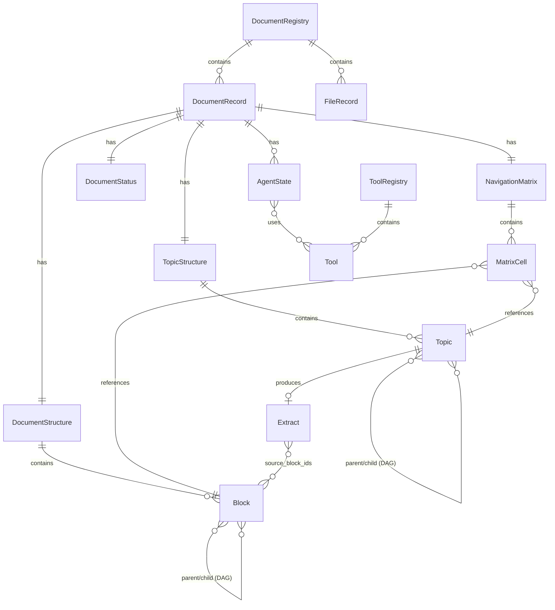

# Agentic Document Processing System
## Архитектурная модель. Уровень 4: Модель данных

**Версия:** 0.1  
**Дата:** 2026-02-02

**Связанные документы:**
- Концептуальная модель (ADPS_Conceptual_Model.md)
- Архитектурная модель. Уровень 1 (ADPS_Architecture_L1.md)
- Архитектурная модель. Уровень 2 (ADPS_Architecture_L2.md)
- Архитектурная модель. Уровень 3 (ADPS_Architecture_L3.md)

---

## 1. Введение

### 1.1. Назначение документа

Документ специфицирует структуры данных системы ADPS: сущности, их поля, связи и форматы хранения. Модель данных обеспечивает реализацию сценариев, описанных в L3.

### 1.2. Нотация

Структуры описаны в YAML-нотации для читаемости. Это не означает, что все данные хранятся в YAML — формат хранения определяется отдельно (см. раздел 11).

### 1.3. Обзор сущностей

| Категория | Сущности |
|-----------|----------|
| Идентификация | Схема идентификаторов |
| Структура документа | Block, DocumentStructure |
| Тематическое измерение | Topic, TopicStructure |
| Навигация | MatrixCell, NavigationMatrix |
| Производные | Extract |
| Агенты | AgentState, Tool, ToolRegistry |
| Реестр | FileRecord, DocumentRecord, DocumentRegistry, DocumentStatus |

---

## 2. Схема идентификаторов

### 2.1. Общий формат

```
{hash}_{type}_{local_id}
```

| Компонент | Описание |
|-----------|----------|
| `hash` | 6 символов, hex, от SHA-256 исходного архива |
| `type` | Тип сущности (3 символа) |
| `local_id` | Локальный идентификатор внутри документа |

### 2.2. Типы идентификаторов

| Сущность | Тип | Пример |
|----------|-----|--------|
| Документ | `doc` | `a3f2c1_doc` |
| Файл | `fil` | `a3f2c1_fil_001` |
| Блок | `blk` | `a3f2c1_blk_3.2.1` |
| Тема | `top` | `a3f2c1_top_risk-management` |
| Выписка | `ext` | `a3f2c1_ext_risk-management` |
| Агент | `agt` | `a3f2c1_agt_q` |
| Запрос | `qry` | `a3f2c1_qry_7b3f` |
| Реестр | `reg` | `a3f2c1_reg` |

### 2.3. Генерация hash

```python
import hashlib

def generate_hash(archive_bytes: bytes) -> str:
    return hashlib.sha256(archive_bytes).hexdigest()[:6]
```

---

## 3. Блок документа

### 3.1. Описание

Блок — структурно выделяемый фрагмент документа: раздел, глава, пункт, приложение. Блоки образуют DAG (направленный ациклический граф) — блок может иметь несколько родителей.

### 3.2. Структура

```yaml
Block:
  block_id: string            # {hash}_blk_{number}
  number: string              # номер в документе: "3.2.1", "Приложение А"
  title: string               # заголовок блока
  level: int                  # уровень вложенности (0 = корень)
  
  # Граф
  parent_ids: string[]        # ID родительских блоков ([] для корневых)
  children_ids: string[]      # ID дочерних блоков
  
  # Расположение (блок может охватывать страницы из разных файлов)
  pages:
    - file_id: string
      page: int
  
  # Контент
  content: string             # извлечённый текст блока
```

### 3.3. Примечания

- `pages` — упорядоченный массив; порядок соответствует логическому порядку страниц в блоке
- `content` — хранится в блоке для самодостаточности Документ-юнита (не зависит от vlm-ocr-doc-reader)
- Множественные родители позволяют моделировать ссылки (например, приложение как дочерний блок и раздела «Приложения», и раздела, который на него ссылается)

---

## 4. Структура документа (DAG)

### 4.1. Описание

Структура документа — DAG блоков с навигацией вверх/вниз и привязкой к страницам. Оглавление — это та же структура (данные о страницах уже в блоках).

### 4.2. Структура

```yaml
DocumentStructure:
  document_id: string
  root_ids: string[]          # ID корневых блоков (parent_ids = [])
  blocks: Block[]             # плоский список всех блоков
```

### 4.3. Индексы (runtime)

| Индекс | Тип | Назначение |
|--------|-----|------------|
| `blocks_by_id` | `Map<block_id, Block>` | Быстрый доступ по ID |
| `blocks_by_page` | `Map<(file_id, page), block_id[]>` | Поиск блоков по странице |

---

## 5. Тема (Topic)

### 5.1. Описание

Тема — смысловая область, выделяемая при анализе документа. Темы образуют граф (могут иметь подтемы и несколько родителей).

### 5.2. Структура

```yaml
Topic:
  topic_id: string            # {hash}_top_{slug}
  slug: string                # короткий код: "risk-management"
  name: string                # название: "Управление рисками"
  description: string         # описание для агентов
  
  # Граф тем
  parent_topic_ids: string[]  # родительские темы ([] для верхнего уровня)
  children_topic_ids: string[]
  
  # Источник
  source: enum                # provider | agent_q
  origin:                     # null для source=provider
    query: string             # исходный запрос
    reasoning: string         # рассуждения агента Q
  
  # Статус разбора
  status: enum                # pending | in_progress | done
```

### 5.3. Структура тем документа

```yaml
TopicStructure:
  document_id: string
  root_topic_ids: string[]    # ID тем верхнего уровня
  topics: Topic[]             # плоский список всех тем
```

### 5.4. Наборы тем (из L3)

| Обозначение | Определение |
|-------------|-------------|
| Т1 | Темы от Топик-провайдера |
| Т2 | Подмножество Т1, релевантное запросу |
| Т3 | Дополнительные темы от агента Q |
| Т_целевые | Т2 ∪ Т3 |
| Т_фоновые | Т1 \ Т2 |
| Т_разобранные | Темы со статусом `done` |

---

## 6. Навигационная матрица

### 6.1. Описание

Таблица соответствия блоков и тем. Хранятся только непустые ячейки (тема отражена в блоке).

### 6.2. Структура ячейки

```yaml
MatrixCell:
  block_id: string
  topic_id: string
  
  # Контент
  full_content: string        # полное описание темы в блоке
  summary: string             # краткое описание
  
  # Флаг полноты
  summary_exhaustive: bool    # true = full_content не содержит информации сверх summary
                              # false = full_content содержит детали, не вошедшие в summary
```

### 6.3. Структура матрицы

```yaml
NavigationMatrix:
  document_id: string
  cells: MatrixCell[]         # только непустые ячейки
```

### 6.4. Индексы (runtime)

| Индекс | Тип | Назначение |
|--------|-----|------------|
| `by_block` | `Map<block_id, MatrixCell[]>` | Все темы в блоке |
| `by_topic` | `Map<topic_id, MatrixCell[]>` | Все блоки по теме |

### 6.5. Семантика

- Отсутствие ячейки = тема не отражена в блоке
- `summary_exhaustive = true` → при сборе ответа достаточно `summary`
- `summary_exhaustive = false` → `full_content` содержит дополнительные детали

---

## 7. Выписка (Extract)

### 7.1. Описание

Производный документ — эссе по одной теме, формируемое топик-агентом. Выписка мутабельна (может дополняться при дозаборе).

### 7.2. Структура

```yaml
Extract:
  extract_id: string          # {hash}_ext_{topic_slug}
  document_id: string
  topic_id: string
  
  # Контент
  title: string               # название выписки
  annotation: string          # краткое описание для сверки с запросами
  content: string             # полный текст эссе
  
  # Структура (узлы темы)
  sections:
    - heading: string
      text: string
      source_block_ids: string[]   # из каких блоков извлечено
  
  # Метаданные
  created_at: datetime
  updated_at: datetime
  source_cells: string[]      # block_id ячеек матрицы, использованных при формировании
```

### 7.3. Использование

1. При новом запросе агент Q сверяет `annotation` существующих выписок с запросом
2. Если выписка релевантна — используется как основа ответа
3. При дозаборе — секции добавляются/обновляются, `updated_at` меняется

---

## 8. Инструменты (Tools)

### 8.1. Описание

Инструменты хранятся отдельно от агентов. Агент содержит только ссылки на инструменты.

### 8.2. Структура инструмента

```yaml
Tool:
  tool_id: string
  name: string                # имя для вызова
  description: string         # когда применять (для LLM)
  parameters_schema: object   # JSON Schema параметров
  # executor — не хранится, подключается в runtime
```

### 8.3. Реестр инструментов

```yaml
ToolRegistry:
  tools: Tool[]
```

---

## 9. Состояние агента

### 9.1. Описание

Агент — хранимое состояние с историей по сессиям. Типы агентов: X (структурный экстрактор), Q (обработка запросов), topic (топик-агент), block (блок-агент).

### 9.2. Структура

```yaml
AgentState:
  agent_id: string            # {hash}_agt_{type}_{local}
  agent_type: enum            # x | q | topic | block
  document_id: string
  
  # Конфигурация
  system_prompt: string
  tool_ids: string[]          # ссылки на Tool в реестре
  
  # История по сессиям
  sessions:
    - session_id: string      # "_default" для агентов без сессий
      messages: Message[]
  
  # Статус
  status: enum                # idle | running | completed | error
  created_at: datetime
  updated_at: datetime
  
  # Опциональные поля по типу агента
  file_ids: string[]?              # X: обрабатываемые файлы
  known_topic_ids: string[]?       # Q: известные темы
  topic_id: string?                # topic, block: обрабатываемая тема
  processed_block_ids: string[]?   # topic: обработанные блоки
  block_id: string?                # block: обрабатываемый блок
```

### 9.3. Сообщение

```yaml
Message:
  role: enum                  # system | user | assistant | tool
  content: string
  tool_call_id: string?       # для tool-результатов
  timestamp: datetime
```

### 9.4. Сессии

- Агенты X, topic, block — одна сессия `_default`
- Агент Q — может иметь несколько сессий (для MCP-сценария)

---

## 10. Реестр документов и статус

### 10.1. Файл

```yaml
FileRecord:
  file_id: string             # {hash}_fil_{seq}
  filename: string            # исходное имя файла
  format: enum                # pdf | docx | xlsx (исходный формат)
  pdf_path: string            # путь к нормализованному PDF
  page_count: int
```

### 10.2. Запись о документе

```yaml
DocumentRecord:
  document_id: string
  title: string               # название (из титульной страницы)
  doc_type: string            # тип документа (для Топик-провайдера)
  description: string         # краткое описание
  file_ids: string[]          # ID файлов документа
  source_archive: string      # имя исходного архива
  created_at: datetime
```

### 10.3. Реестр документов

Результат работы Препроцессора, передаётся Координатору.

```yaml
DocumentRegistry:
  registry_id: string         # {hash}_reg
  source_archive: string
  created_at: datetime
  documents: DocumentRecord[]
  files: FileRecord[]
```

### 10.4. Статус обработки

Многокомпонентный статус внутри Документ-юнита.

```yaml
DocumentStatus:
  document_id: string
  
  # Базовая обработка (однократная)
  structure:
    status: enum              # pending | in_progress | done | error
    completed_at: datetime?
  
  # Тематическая обработка (по темам)
  topics:
    - topic_id: string
      status: enum            # pending | in_progress | done | error
      triggered_by: enum      # provider | query
      query_id: string?       # если triggered_by = query
  
  # Запросы (активные вопросы)
  queries:
    - query_id: string        # {hash}_qry_{uuid_short}
      text: string            # текст запроса
      status: enum            # pending | processing | answered | error
      created_at: datetime
      answered_at: datetime?
```

---

## 11. Форматы хранения

| Категория | Формат | Обоснование |
|-----------|--------|-------------|
| Конфигурация (tools, prompts) | YAML | Человекочитаемый, удобно редактировать |
| Структуры (DAG, матрица, состояния) | JSON | Проще парсить программно |
| Контент (выписки, content блоков) | YAML multiline / .md | Удобство просмотра |
| Runtime (индексы, кэши) | In-memory | — |

**Перспектива:** SQLite / PostgreSQL с JSONB при масштабировании.

---

## 12. Диаграмма связей сущностей



---

## 13. Открытые вопросы

| # | Вопрос | Контекст |
|---|--------|----------|
| 1 | Версионирование структур | Нужна ли миграция при изменении схемы? |
| 2 | Ограничения на размеры | Максимальный размер content, full_content, выписки |
| 3 | Очистка истории агентов | Политика ротации для длинных сессий |

---

## Приложение А. Пример данных

### А.1. Блок

```yaml
block_id: "a3f2c1_blk_3.2.1"
number: "3.2.1"
title: "Порядок проведения проверки"
level: 3
parent_ids: ["a3f2c1_blk_3.2"]
children_ids: ["a3f2c1_blk_3.2.1.1", "a3f2c1_blk_3.2.1.2"]
pages:
  - file_id: "a3f2c1_fil_001"
    page: 45
  - file_id: "a3f2c1_fil_001"
    page: 46
content: "3.2.1. Порядок проведения проверки\n\nПроверка проводится..."
```

### А.2. Тема

```yaml
topic_id: "a3f2c1_top_risk-management"
slug: "risk-management"
name: "Управление рисками"
description: "Процедуры идентификации, оценки и управления рисками"
parent_topic_ids: []
children_topic_ids: ["a3f2c1_top_credit-risk", "a3f2c1_top_operational-risk"]
source: provider
origin: null
status: done
```

### А.3. Ячейка матрицы

```yaml
block_id: "a3f2c1_blk_3.2.1"
topic_id: "a3f2c1_top_risk-management"
full_content: "В разделе 3.2.1 описывается порядок проведения проверки с точки зрения выявления рисков. Проверяющий обязан оценить: (1) наличие системы управления рисками, (2) полноту идентификации рисков, (3) адекватность методов оценки..."
summary: "Описан порядок проверки системы управления рисками: наличие, полнота идентификации, адекватность оценки"
summary_exhaustive: false
```

### А.4. Выписка

```yaml
extract_id: "a3f2c1_ext_risk-management"
document_id: "a3f2c1_doc"
topic_id: "a3f2c1_top_risk-management"
title: "Управление рисками в документе"
annotation: "Комплексное описание требований к системе управления рисками: идентификация, оценка, мониторинг, контроль"
content: "..."
sections:
  - heading: "Общие требования"
    text: "..."
    source_block_ids: ["a3f2c1_blk_2.1", "a3f2c1_blk_2.2"]
  - heading: "Порядок проверки"
    text: "..."
    source_block_ids: ["a3f2c1_blk_3.2.1"]
created_at: "2026-02-02T10:30:00Z"
updated_at: "2026-02-02T14:15:00Z"
source_cells: ["a3f2c1_blk_2.1", "a3f2c1_blk_2.2", "a3f2c1_blk_3.2.1"]
```
