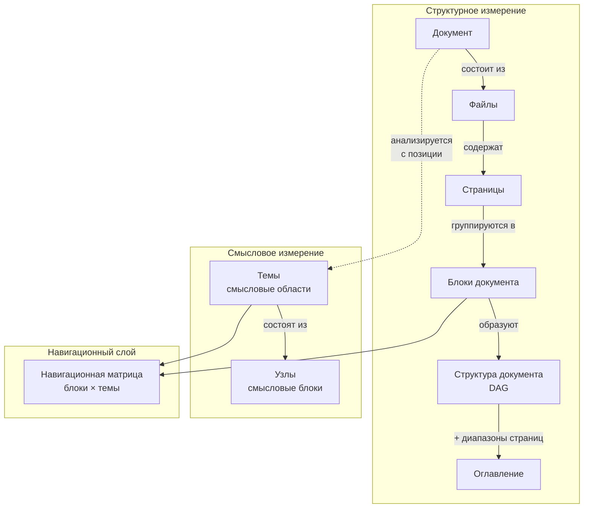
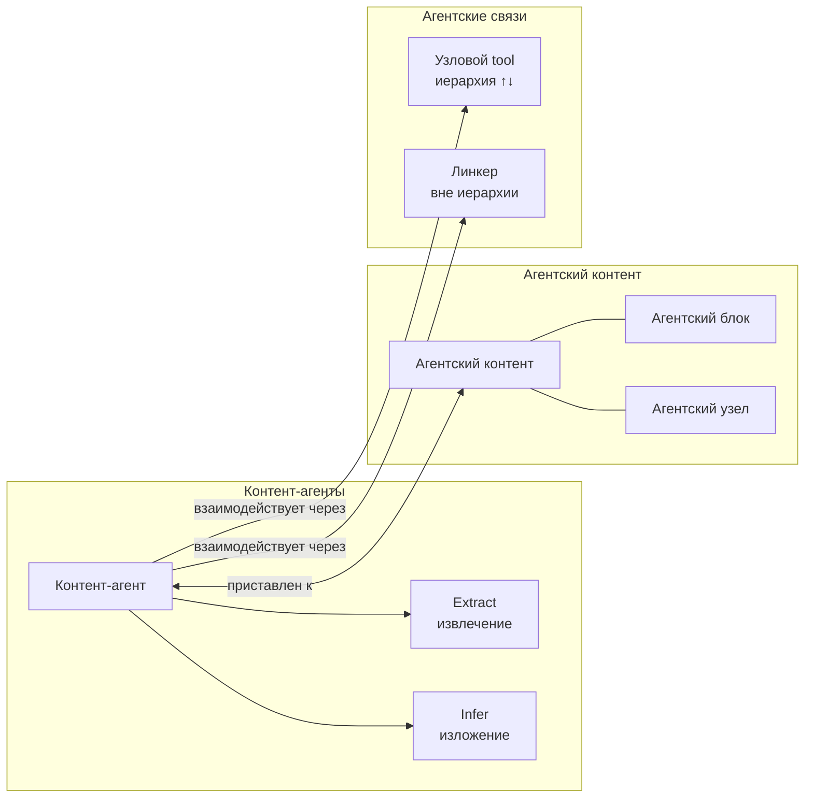
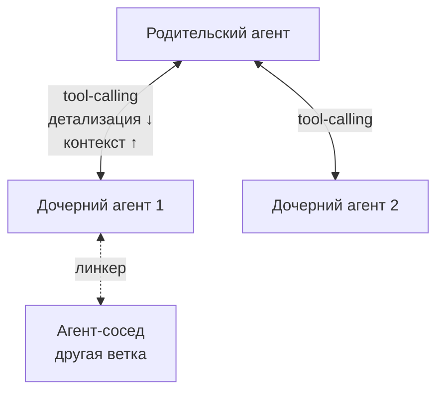
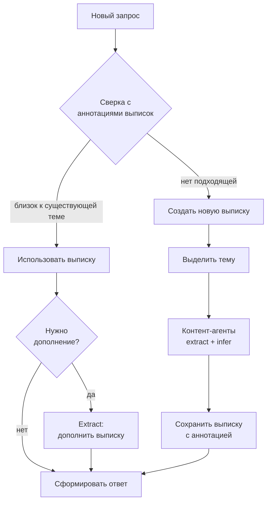
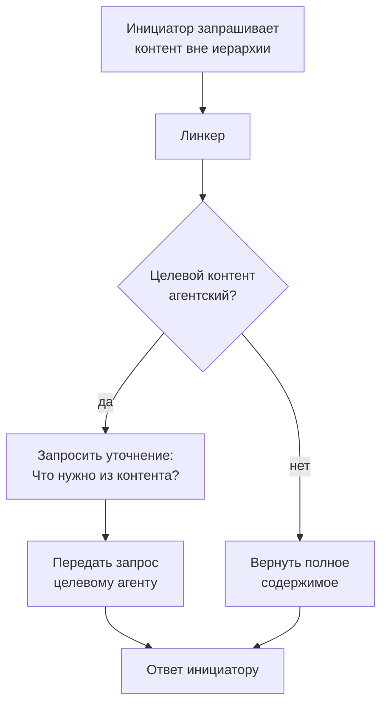
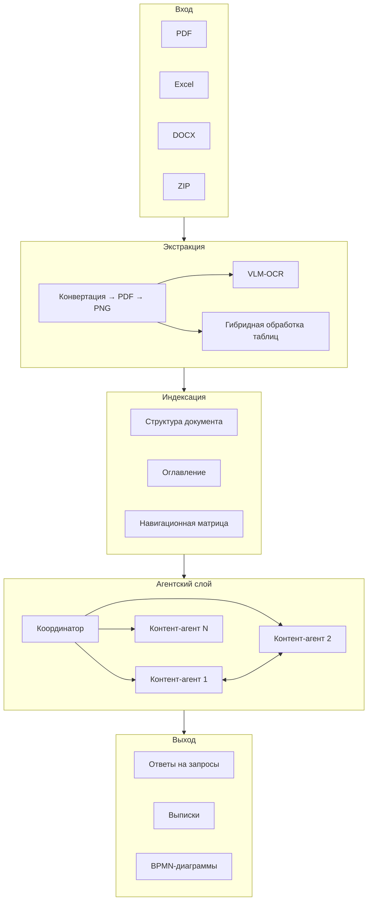

# Agentic Document Processing System
## Концептуальная модель

**Версия:** 0.2  
**Дата:** 2026-01-28

---

## 1. Назначение и границы системы

### 1.1. Цели

Система предназначена для глубокого анализа больших документов (сотни страниц) с помощью ИИ-агентов.

Ключевые задачи:
- Извлечение информации и ответы на вопросы по содержанию документа
- Анализ внутренних нестыковок в документе
- Сравнение с другими документами, включая выявление несоответствий нормативным требованиям
- Формализация регламентов (BPMN-диаграммы, правила в виде триггеров)

### 1.2. Типы анализируемых документов

**Регуляторные документы** — Положения ЦБ, нормативные акты, методические указания.  
Характеристики: сотни страниц, сложная иерархическая нумерация (1.1.1.1), множество приложений, таблицы форм отчётности.

**Отчёты эмитентов** — годовые отчёты, ESG-раскрытия, аудиторские заключения, проспекты эмиссии.  
Характеристики: финансовая отчётность в табличном виде, текстовые разделы с анализом, приложения.

### 1.3. Ключевые ограничения и приоритеты

| Параметр | Значение |
|----------|----------|
| Приоритет | Точность и непротиворечивость (не скорость) |
| Нагрузка | Малое количество пользователей (<100), высокая сложность документов |
| Время обработки | Не ограничено |
| Формат входа | PDF (включая сканы), Excel с несколькими листами, DOCX, ZIP-архивы |
| Экстракция текста | VLM-OCR для всех форматов (конвертация → PDF → PNG) |
| Обработка таблиц | Гибридная: VLM-классификация → числовые из исходника (Pandas), текстовые через VLM-OCR (cell flattening) |
| Модели агентов | Дешёвые модели (Claude Haiku, GPT-5-mini, локальные) с SGR-структурированием |

### 1.4. Исключённые подходы

Система **не использует**:
- Наивное чанкование + векторные базы данных
- GraphRAG в смысле графов знаний (концептуальные сущности и отношения)
- Надежду на LLM с большим контекстным окном как основное решение

---

## 2. Понятийный аппарат

### 2.1. Иерархия контента

#### Документ (основной документ)
Верхнеуровневое понятие, обозначающее весь анализируемый контент. Документ может состоять из одного или более файлов.

#### Файл
Единица хранения контента, относящегося к документу. Один документ может включать несколько файлов (основная часть, приложения и т.д.).

#### Страница
Фрагмент контента, преобразуемый в единичный файл изображения для передачи в систему VLM-OCR. Маркируется атрибутами: идентификатор файла, номер страницы в файле.

### 2.2. Структурное измерение

#### Блок документа
Структурно выделяемый фрагмент документа: раздел, глава, абзац, приложение. Блоки образуют иерархию, задаваемую структурой самого документа (заголовки, нумерация).

#### Структура документа
DAG (направленный ациклический граф), характеризующий структурную вложенность блоков документа. Формируется преимущественно на основе структуры заголовков.

### 2.3. Смысловое измерение

#### Тема (смысловая область)
Часть контента документа, выделяемая по смысловым/тематическим критериям с определённой позиции анализа.

Ключевые характеристики:
- Не имеет строгой привязки к структурным частям документа
- Может присутствовать в разных блоках документа
- Может не быть явно артикулирована в тексте, а логически вытекать из анализа
- Не существует в документе изначально — выделяется в результате анализа с некоторой позиции

*Пример: в документе «Порядок надзора за банками» может быть выделена тема «планирование и назначение задач надзора».*

#### Узел (смысловой блок)
Фрагмент темы. Отношение узла к теме аналогично отношению блока к документу — это часть целого в смысловом измерении.

*Пример: в теме «планирование надзора» — узел «планирование надзора за микрофинансовыми организациями».*

### 2.4. Обобщение: целое и часть

| Измерение | Целое | Часть |
|-----------|-------|-------|
| Структурное | Документ | Блок документа |
| Смысловое | Тема (смысловая область) | Узел (смысловой блок) |

---

## 3. Навигационный слой

Группа инструментов для нахождения страниц, относящихся к блокам документа или темам.

### 3.1. Оглавление

Структура документа (DAG блоков), где каждому элементу сопоставлен диапазон или массив страниц, содержащих соответствующий блок.

### 3.2. Навигационная матрица

Таблица соответствия структурного и смыслового измерений:
- **Строки** — элементы оглавления (блоки документа)
- **Столбцы** — темы, выделенные в процессе анализа
- **Ячейки** — описание того, как соответствующая тема отражена в соответствующем блоке

### 3.3. Жизненный цикл навигационной матрицы

Темы выделяются одним из способов:
1. **По шаблону** — для известных типов документов используется предзаданный набор тем
2. **По запросу** — при первом запросе к документу выделяются темы, релевантные запросу
3. **Агентом-анализатором** — отдельный агент формирует набор тем на основе общего анализа документа

На практике: для типовых документов накапливаются шаблоны; для нетиповых — матрица формируется после первого запроса.

---

## 4. Агентская модель

### 4.1. Контент-агенты

ИИ-агенты, отвечающие за работу с контентом документа. Два основных режима работы:
- **Extract** — извлечение информации из основного документа
- **Infer** — изложение, анализ, формирование ответов на основе извлечённой информации

### 4.2. Агентский контент

Обобщающий термин для фрагментов контента, к которым «приставлен» контент-агент.

#### Агентский блок
Блок документа, обрабатываемый выделенным контент-агентом.

#### Агентский узел
Узел темы, обрабатываемый выделенным контент-агентом.

**Критерии выделения агентского контента:**
- Однородность темы/содержания
- Оптимальность по размеру контекста (не слишком большой, не слишком малый для эффективной работы агента)

### 4.3. Агентские связи

Механизмы взаимодействия контент-агентов для формирования ответов на запросы.

#### Узловой tool (tool-calling)
Инструмент обращения к контент-агенту через механизм tool-calling.

Применение: взаимодействие агентов, отвечающих за иерархически связанный контент.

Направления вызова:
- **Вниз** — от родительского агента к дочернему (детализация)
- **Вверх** — от дочернего агента к родительскому (расширение контекста)

#### Линкер
Инструмент навигации к контенту, не состоящему в иерархических отношениях с инициатором.

Режимы работы:
1. **Целевой контент является агентским** — линкер запрашивает у инициатора уточнение: «Что именно вы хотите получить из [название блока/узла]?», затем передаёт запрос соответствующему агенту
2. **Целевой контент не является агентским** — линкер возвращает инициатору полное содержимое запрошенного блока/узла

---

## 5. Производные документы

### 5.1. Выписка (сводка)

Производный документ, содержащий все материалы по одной теме.

Характеристики:
- Одна тема — одна выписка
- Структура выписки соответствует структуре узлов темы
- Выписка сохраняется как «постоянный кэш» с аннотацией

### 5.2. Использование выписок

При поступлении нового запроса:
1. Выполняется сверка запроса с аннотациями существующих выписок
2. Если запрос «близок» к существующей теме/выписке:
   - Выписка используется как основа ответа
   - При необходимости контент-агенты дорабатывают выписку в режиме extract
3. Если подходящей выписки нет — создаётся новая

---

## 6. Глоссарий

| Термин | Определение |
|--------|-------------|
| Документ | Весь анализируемый контент (может состоять из нескольких файлов) |
| Файл | Единица хранения контента документа |
| Страница | Фрагмент контента, преобразуемый в изображение для VLM-OCR |
| Блок документа | Структурно выделяемый фрагмент документа |
| Структура документа | DAG вложенности блоков документа |
| Тема (смысловая область) | Часть контента, выделяемая по смысловым критериям с позиции анализа |
| Узел (смысловой блок) | Фрагмент темы |
| Навигационный слой | Инструменты нахождения страниц по блокам/темам |
| Оглавление | Структура документа с привязкой к страницам |
| Навигационная матрица | Таблица соответствия блоков и тем |
| Контент-агент | ИИ-агент для извлечения и изложения контента |
| Агентский контент | Фрагмент контента с приставленным агентом |
| Агентский блок | Блок документа с приставленным агентом |
| Агентский узел | Узел темы с приставленным агентом |
| Узловой tool | Механизм tool-calling между иерархически связанными агентами |
| Линкер | Инструмент навигации к неиерархически связанному контенту |
| Выписка (сводка) | Производный документ по одной теме |

---

## Приложение А. Диаграммы понятий

### А.1. Иерархия контента и измерения

### А.2. Агентская модель

### А.3. Взаимодействие агентов через tool-calling

### А.4. Жизненный цикл выписок

### А.5. Работа линкера

### А.6. Общая архитектура системы

