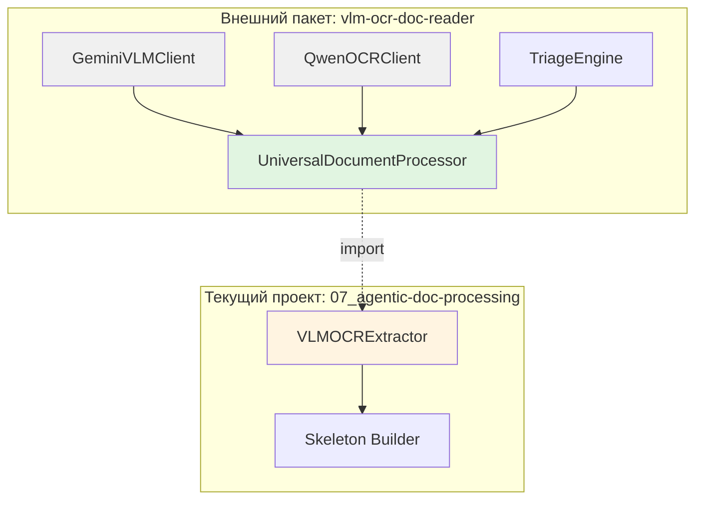

# Decision 005: Интеграция VLM-OCR через внешний пакет vlm-ocr-doc-reader

**Статус:** Принято
**Дата:** 2025-01-26
**Обновлено:** 2025-01-26 (изменена стратегия на внешний пакет)
**Контекст:** Задача 015, Architect

---

## Контекст

В проекте `05_a_reports_ETL_02/` реализован **РАБОЧИЙ** VLM-OCR pipeline с проверенными компонентами:
- **VLMClient** — обертка над Gemini API с throttling, retry, backoff
- **QwenClient** — специализированный OCR для точного извлечения чисел/идентификаторов
- **HybridDialogueManager** — оркестрация Gemini + Qwen для аудиторских заключений

Текущий проект `07_agentic-doc-processing/` ожидает контракт `DocumentData(text, structure, tables)` в `vlm_ocr_extractor.py`.

**Проблема:** Необходимо переиспользовать наработки из `05_a_reports_ETL_02/` для generic документов, не duplicating код.

---

## Решение

**Использовать внешний пакет `vlm-ocr-doc-reader` как зависимость.**

### Стратегия интеграции

```
┌─────────────────────────────────────────────────────────────┐
│  Отдельный проект: vlm-ocr-doc-reader                       │
│  (универсальный модуль работы с документами)               │
│  - BaseVLMClient, BaseOCRClient                            │
│  - GeminiVLMClient, QwenOCRClient                          │
│  - UniversalDocumentProcessor                              │
│  - Методы: triage(), add_cluster(), ask_vlm(), ask_ocr()  │
└─────────────────────────────────────────────────────────────┘
                         ↑ pip install
┌─────────────────────────────────────────────────────────────┐
│  Текущий проект: 07_agentic-doc-processing                 │
│  - Установка пакета как зависимость                        │
│  - Адаптер под контракт DocumentData                        │
│  - Специфичная логика текущего проекта                     │
└─────────────────────────────────────────────────────────────┘
```

### Почему внешний пакет

| Критерий | Копипаст (v1.0) | Общая папка | Внешний пакет |
|----------|-----------------|-------------|---------------|
| **Дублирование кода** | ❌ Да | ✅ Нет | ✅ Нет |
| **Переиспользование в проектах** | ❌ Нет | ⚠️ Только локально | ✅ Любой проект |
| **Версионирование** | ❌ Нет | ❌ Нет | ✅ Семантическое |
| **Независимая разработка** | ❌ Нет | ⚠️ Сложно | ✅ Легко |
| **Скорость реализации v1.0** | ✅ Быстро | ⚠️ Средне | ⚠️ Средне |

**Решение:** **Внешний пакет** — инвестиция в будущем, окупается при использовании в 3+ проектах.

---

## Установка и интеграция

### 1. Установка пакета

```bash
# Разработка (локальный пакет)
pip install -e ../../path/to/vlm-ocr-doc-reader

# Или после публикации
pip install vlm-ocr-doc-reader>=0.1.0
```

### 2. Зависимости в requirements.txt

```txt
# VLM-OCR универсальный модуль
vlm-ocr-doc-reader>=0.1.0

# Зависимости пакета (автоматически установятся)
pydantic>=2.0.0
requests>=2.31.0
python-dotenv
pillow
```

### 3. Конфигурация (.env)

```bash
# Gemini API (для VLM)
GEMINI_API_KEY=your_gemini_api_key
VLM_MODEL=gemini-2.5-flash
VLM_MIN_INTERVAL_S=0.6
VLM_MAX_RETRIES=3

# Qwen API (для OCR)
QWEN_API_KEY=your_qwen_api_key  # если используется
OCR_MODEL=qwen-vl-plus
```

---

## Адаптация под контракт текущего проекта

### Интерфейс пакета

```python
from vlm_ocr_doc_reader import UniversalDocumentProcessor

# Создание процессора
processor = UniversalDocumentProcessor(
    source="document.pdf",  # или список PNG
    vlm_client="gemini",     # или свой GeminiVLMClient
    ocr_client="qwen"        # или свой QwenOCRClient
)
```

### Основные методы пакета

| Метод | Назначение | Использование в текущем проекте |
|-------|------------|----------------------------------|
| `triage(prompt)` | Выборка страниц | ⚠️ Опционально (будущее) |
| `add_cluster(name, pages, desc)` | Добавить кластер | ⚠️ Опционально (будущее) |
| `get_cluster(name)` | Получить кластер | ⚠️ Опционально (будущее) |
| `ask_vlm(prompt, images)` | Вопрос к VLM | ⚠️ Опционально (расширение) |
| `ask_ocr(question, page_num)` | Точное извлечение | ⚠️ Опционально (расширение) |
| `describe_full(...)` | **Полное описание** | ✅ **ОСНОВНОЙ МЕТОД** |

### Адаптер под текущий проект

```python
# 02_src/processing/vlm_ocr_extractor.py

from vlm_ocr_doc_reader import UniversalDocumentProcessor
from vlm_ocr_doc_reader.schemas import DocumentData as VLMDocumentData
from .vlm_schemas import DocumentData  # Ваш контракт

class VLMOCRExtractor:
    """Facade для текущего проекта"""

    def __init__(self, source: Union[str, List[bytes]]):
        self.processor = UniversalDocumentProcessor(source)

    def extract_full_document(self, images: List[bytes]) -> DocumentData:
        """
        Контракт текущего проекта.
        Делегирование универсальному модулю.
        """
        # Вызываем метод пакета
        vlm_data: VLMDocumentData = self.processor.describe_full(
            include_text=True,
            include_diagrams=True,
            include_tables_with_flattening=True
        )

        # Адаптация под ваш контракт (если нужно)
        return DocumentData(
            text=vlm_data.text,
            structure=vlm_data.structure,
            tables=vlm_data.tables
        )
```

---

## Архитектура интеграции



---

## Функциональность пакета

### Базовые интерфейсы

```python
# vlm_ocr_doc_reader/clients/base.py

class BaseVLMClient(ABC):
    """Базовый интерфейс для VLM"""

    @abstractmethod
    def ask_vlm(
        self,
        prompt: str,
        images: List[bytes],
        tools: Optional[List[Dict]] = None,
        history: Optional[List[Dict]] = None
    ) -> Dict[str, Any]:
        pass


class BaseOCRClient(ABC):
    """Базовый интерфейс для OCR"""

    @abstractmethod
    def ask_ocr(
        self,
        image: bytes,
        question: str,
        expected_type: Optional[str] = None
    ) -> Dict[str, Any]:
        """
        Returns:
            {
                "status": "ok" | "no_data" | "error",
                "value": "...",
                "context": "...",
                "explanation": "..."
            }
        """
        pass
```

### Реализации

```python
# vlm_ocr_doc_reader/clients/gemini_vlm.py
class GeminiVLMClient(BaseVLMClient):
    def ask_vlm(self, prompt, images, tools=None, history=None):
        # Реализация через Gemini API
        pass

# vlm_ocr_doc_reader/clients/qwen_ocr.py
class QwenOCRClient(BaseOCRClient):
    def ask_ocr(self, image, question, expected_type=None):
        # Реализация через Qwen API
        pass
```

### UniversalDocumentProcessor

```python
class UniversalDocumentProcessor:
    """Универсальный процессор документов"""

    def __init__(self, source, vlm_client=None, ocr_client=None):
        pass

    # === Triage ===
    def triage(self, prompt: str, method: str = "prompt") -> List[int]:
        """
        Выборка страниц по промпту.
        method: "prompt" — сейчас, "algorithm" — будущее
        """
        pass

    # === Кластеризация ===
    def add_cluster(self, name: str, pages: List[int], description: str):
        """Добавить кластер страниц"""
        pass

    def get_cluster(self, name: str) -> ClusterInfo:
        """Получить кластер по имени"""
        pass

    def cluster_by_prompt(self, prompt: str) -> Dict[str, ClusterInfo]:
        """Автоматическая кластеризация"""
        pass

    # === Вопросы к документу ===
    def ask_vlm(self, prompt: str, images=None, tools=None) -> Dict:
        """Вопрос к VLM по документу или кластеру"""
        pass

    def ask_ocr(self, question: str, page_num: int, expected_type=None) -> Dict:
        """Точное извлечение через OCR"""
        pass

    # === Полное описание (ОСНОВНОЙ МЕТОД) ===
    def describe_full(
        self,
        include_text: bool = True,
        include_diagrams: bool = True,
        include_tables_with_flattening: bool = True,
        pages: Optional[List[int]] = None
    ) -> DocumentData:
        """Полное описание документа"""
        pass
```

---

## Зависимости

### Обязательные зависимости пакета

```txt
pydantic>=2.0.0          # Schema validation
requests>=2.31.0         # HTTP клиенты
python-dotenv            # API ключи
pillow                   # Работа с изображениями
```

### Опциональные зависимости

```txt
# Для Gemini VLM
google-generativeai      # Или REST API через requests

# Для Qwen OCR
openai                   # Qwen использует OpenAI-compatible API
```

---

## Обоснование архитектурных решений

### 1. Почему разделены VLM и OCR клиенты

**Архитектура:**
- `BaseVLMClient` — для понимания контекста, диалогов, сложных вопросов
- `BaseOCRClient` — для точного извлечения чисел/идентификаторов

**Обоснование:**
- Разные цели: VLM = понимание, OCR = точность
- Разные модели: Gemini (мультимодальный) vs Qwen (специализированный)
- Легко добавить другие реализации (Claude VLM, Tesseract OCR)

### 2. Почему методы называются ask_vlm / ask_ocr

**Обоснование:**
- Явно указывает, к какой модели обращаемся
- `ask_vlm()` — понятнее чем `query()` или `process()`
- `ask_ocr()` — понятнее чем `extract()` или `parse()`

### 3. Почему triage с параметром method

**Обоснование:**
- Стартово `"prompt"` — быстрая реализация для v1.0
- `"algorithm"` —预留 для сложного алгоритма из `05_a_reports_ETL_02`
- Плавная миграция без слома API

### 4. Почему describe_full — основной метод

**Обоснование:**
- Это **именно контракт текущего проекта** — `DocumentData(text, structure, tables)`
- Другие методы (`triage`, `ask_vlm`, `ask_ocr`) — расширение для будущих задач
- Пакет универсальный, но для текущего проекта используется `describe_full()`

---

## Последствия

### Для текущего проекта

**Новые зависимости:**
- `vlm-ocr-doc-reader>=0.1.0`

**Изменения в коде:**
1. `requirements.txt` — добавить зависимость
2. `02_src/processing/vlm_ocr_extractor.py` — использовать пакет
3. `.env` — добавить API ключи

**НЕ нужно копировать:**
- ❌ GeminiRestClient
- ❌ VLMClient
- ❌ QwenClient
- ❌ VLM Schemas

Все это — внутри пакета.

### Для будущего проекта (vlm-ocr-doc-reader)

**Задача:** Создать универсальный пакет для работы с документами

**Детальная документация:** См. `01_tasks/015_vlm_ocr_integration/vlm_ocr_doc_reader_spec.md`

---

## План реализации

### Этап 1: Создание пакета (отдельный проект)

**Задачи:**
1. Создать структуру пакета `vlm-ocr-doc-reader`
2. Реализовать базовые интерфейсы `BaseVLMClient`, `BaseOCRClient`
3. Реализовать `GeminiVLMClient`, `QwenOCRClient`
4. Реализовать `UniversalDocumentProcessor` с методами
5. Написать тесты, документацию
6. Упаковать в pip-пакет

**Ответственный:** Отдельный архитектор нового проекта

### Этап 2: Интеграция в текущий проект

**Задачи:**
1. Добавить зависимость в `requirements.txt`
2. Обновить `VLMOCRExtractor` для использования пакета
3. Настроить `.env` с API ключами
4. Написать интеграционные тесты

**Ответственный:** Tech Lead текущего проекта → Developer

---

## Критерии готовности

### Пакет vlm-ocr-doc-reader

- [ ] Базовые интерфейсы реализованы
- [ ] GeminiVLMClient работает
- [ ] QwenOCRClient работает
- [ ] `describe_full()` возвращает `DocumentData`
- [ ] Тесты покрывают основную функциональность
- [ ] Документация API
- [ ] Пакет устанавливается через pip

### Интеграция в текущий проект

- [ ] `vlm-ocr-doc-reader` добавлен в зависимости
- [ ] `VLMOCRExtractor` использует пакет
- [ ] Интеграционные тесты проходят
- [ ] Mock VLM-OCR для тестов работает

---

## Примечание: Разграничение с LLM Gateway

**VLM-OCR Infrastructure независима от LLM Gateway:**

| Компонент | Назначение | Использует |
|-----------|------------|------------|
| **VLM-OCR (пакет)** | Извлечение текста/структуры | Прямые вызовы Gemini/Qwen |
| **LLM Gateway** | Агенты системы | Упрощенная реализация (ретраи) |

**Обоснование:** VLM-OCR требует специфичных параметров (throttling, batch prompts), не зависит от агентов.

---

## Связанные решения

- **ADR-001:** Форматы документов (VLM-OCR как унифицированный экстрактор)
- **ADR-003:** Интеграция VLM-OCR модуля (базовое решение, superseded by ADR-005)
- **Задача 015:** VLM-OCR Module Integration Architecture
- **Новое:** Спецификация пакета `vlm-ocr-doc-reader` (отдельный документ)

---

## Следующие шаги

1. **Отдельный проект:** Архитектор создает пакет `vlm-ocr-doc-reader` согласно спецификации
2. **Текущий проект:** Tech Lead обновляет `implementation_plan.md` с учетом ADR-005
3. **Интеграция:** После готовности пакета — интеграция в текущий проект

**Спецификация пакета:** `01_tasks/015_vlm_ocr_integration/vlm_ocr_doc_reader_spec.md`
