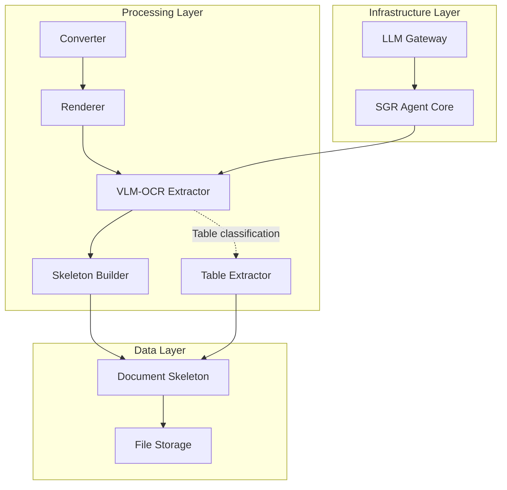
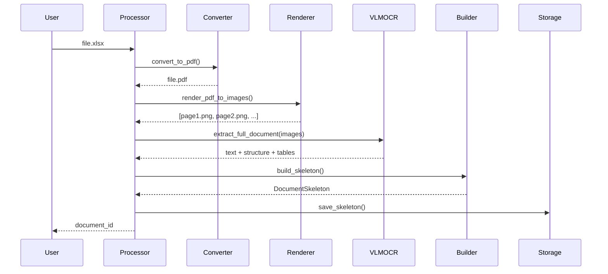
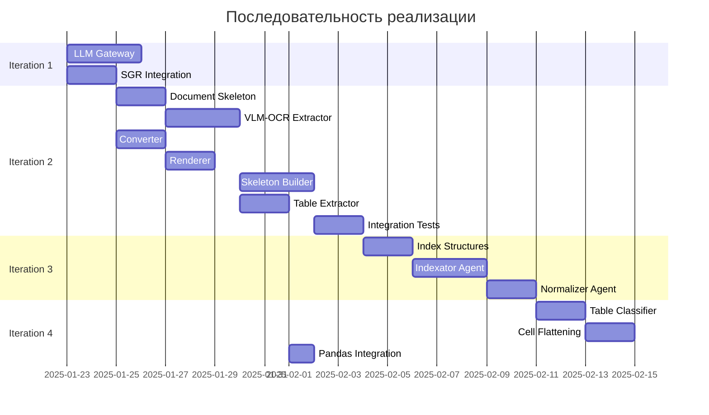

# Implementation Plan: Agentic Document Processing System

**Версия:** 1.2
**Дата:** 2025-01-23
**Статус:** Обновлено после ADR 001-003

---

## Цель

Создать систему для глубокого анализа больших документов (сотни страниц) с помощью AI-агентов на основе фреймворка SGR (Schema-Guided Reasoning).

**Ключевой архитектурный выбор:** VLM-OCR как унифицированный экстрактор для всех форматов документов.

---

## Обзор модулей

### Архитектурная схема



### Описание модулей

**LLM Gateway**
- Назначение: Централизованный доступ к LLM с батчингом
- Зависимости: Langchain клиенты для каждого провайдера
- Предоставляет: Единый интерфейс для всех агентов

**VLM-OCR Extractor**
- Назначение: Унифицированный экстрактор для всех форматов
- Зависимости: Существующий PoC VLM-OCR модуль
- Предоставляет: Текст, структуру, классификацию таблиц

**Converter**
- Назначение: Конвертация DOCX/Excel/text-PDF в PDF
- Зависимости: LibreOffice/python-docx/openpyxl
- Предоставляет: Унифицированный входной формат

**Renderer**
- Назначение: PDF → PNG (постранично)
- Зависимости: pdf2image или pdftoppm
- Предоставляет: Изображения страниц для VLM-OCR

**Skeleton Builder**
- Назначение: Агрегация результатов VLM-OCR в DocumentSkeleton
- Зависимости: VLM-OCR Extractor, Document Skeleton структуры
- Предоставляет: Готовый скелет документа

**Table Extractor**
- Назначение: Извлечение числовых таблиц из исходного файла
- Зависимости: Pandas, openpyxl
- Предоставляет: DataFrames для вычислений

**Document Skeleton**
- Назначение: Хранение физической структуры документа
- Предоставляет: Интерфейс доступа к узлам документа

---

## Итерация 1: Инфраструктурный слой

**Цель:** Создать фундамент для всех агентов.

**Модули для реализации:**
1. LLM Gateway
2. SGR Agent Core интеграция

### Интерфейсы

#### LLM Gateway

```python
from typing import List, Dict, Any, Optional
from enum import Enum

class ModelProvider(str, Enum):
    CLAUDE_HAIKU = "claude-haiku"
    CLAUDE_SONNET = "claude-sonnet"
    GPT_4O_MINI = "gpt-4o-mini"

class LLMGateway:
    """Централизованный доступ к LLM через Langchain"""

    def __init__(self, config: Dict[str, Any]):
        pass

    async def request(self, request: LLMRequest) -> LLMResponse:
        pass

    async def batch(self, requests: List[LLMRequest]) -> List[LLMResponse]:
        pass
```

**Критерии готовности:**
- [ ] LLM Gateway с batching через Langchain
- [ ] MockLLMGateway для тестов
- [ ] SystemSGRAgent базовый класс

---

## Итерация 2: Document Processing Pipeline

**Цель:** Создать pipeline для извлечения данных из документов через VLM-OCR.

**Модули для реализации:**
1. Document Skeleton (структуры данных)
2. VLM-OCR Extractor (обёртка)
3. Converter (DOCX/Excel → PDF)
4. Renderer (PDF → PNG)
5. Skeleton Builder (агрегация)
6. Table Extractor (числовые таблицы)
7. File Storage

### Интерфейсы

#### Document Skeleton

```python
from typing import List, Dict, Optional
from enum import Enum
from dataclasses import dataclass

class NodeType(str, Enum):
    CHAPTER = "chapter"
    SECTION = "section"
    APPENDIX = "appendix"
    TABLE = "table"
    FIGURE = "figure"
    ROOT = "root"

@dataclass
class PageRange:
    start: int
    end: int

@dataclass
class Node:
    id: str
    type: NodeType
    title: Optional[str]
    content: str
    page_range: PageRange
    parent_id: Optional[str]
    children_ids: List[str]
    internal_structure: Dict[str, Any]
    explicit_refs: List[str]
    hash: str
    table_data: Optional[Dict[str, Any]] = None  # для числовых таблиц

class DocumentSkeleton:
    document_id: str

    async def get_node(self, node_id: str) -> Optional[Node]:
        pass

    async def get_root(self) -> Node:
        pass

    async def get_children(self, node_id: str) -> List[Node]:
        pass
```

#### VLM-OCR Extractor

```python
class VLMOCRRequest:
    images: List[bytes]
    prompts: List[str]

class VLMOCRResponse:
    success: bool
    results: List[ExtractionResult]

class ExtractionResult:
    prompt: str
    data: Dict[str, Any]

class VLMOCRExtractor:
    """Обёртка над VLM-OCR модулем"""

    def __init__(self, vlm_ocr_module):
        self.vlm = vlm_ocr_module

    def extract_full_document(self, images: List[bytes]) -> DocumentData:
        """
        Batch prompts:
        - "Верни весь текст"
        - "Опиши структуру"
        - "Найди таблицы, классифицируй"
        """
        results = self.vlm.extract(images, prompts=[...])

        return DocumentData(
            text=results[0].data,
            structure=results[1].data,
            tables=results[2].data
        )
```

#### Converter

```python
class FileType(str, Enum):
    PDF = "pdf"
    DOCX = "docx"
    XLSX = "xlsx"
    TXT = "txt"

class Converter:
    """Конвертация любых форматов в PDF"""

    async def convert_to_pdf(self, file_path: str, file_type: FileType) -> str:
        """
        Конвертировать файл в PDF.
        Возвращает путь к PDF.
        """
        pass
```

#### Renderer

```python
class Renderer:
    """PDF → PNG (постранично)"""

    async def render_pdf_to_images(self, pdf_path: str) -> List[bytes]:
        """
        Рендерить PDF в список PNG-изображений.
        Каждая страница = отдельный PNG.
        """
        pass
```

#### Skeleton Builder

```python
class SkeletonBuilder:
    """Агрегация результатов VLM-OCR в DocumentSkeleton"""

    async def build_skeleton(
        self,
        document_data: DocumentData,
        document_id: str
    ) -> DocumentSkeleton:
        """
        Построить DocumentSkeleton из данных VLM-OCR.

        document_data содержит:
        - text: полный текст
        - structure: иерархия заголовков
        - tables: классифицированные таблицы
        """
        pass
```

#### Table Extractor

```python
class TableExtractor:
    """Извлечение числовых таблиц из исходного файла"""

    async def extract_table(
        self,
        file_path: str,
        table_id: str,
        location: Dict[str, Any]
    ) -> Dict[str, Any]:
        """
        Извлечь числовую таблицу из Excel/PDF.
        Возвращает DataFrame-совместимую структуру.
        """
        pass
```

**Стратегия моков:**
- **VLM-OCR:** Mock с предопределёнными ответами из fixtures
- **Converter/Renderer:** Test fixtures с готовыми PDF/PNG
- **Table Extractor:** Mock с фиктивными DataFrame

**Критерии готовности:**
- [ ] DocumentSkeleton структуры данных
- [ ] VLMOCRExtractor с mock VLM-OCR
- [ ] Converter для DOCX/Excel
- [ ] Renderer для PDF → PNG
- [ ] Skeleton Builder агрегирует результаты
- [ ] Table Extractor для числовых таблиц
- [ ] FileStorage для сохранения скелетов
- [ ] Интеграционные тесты полного pipeline

**Визуализация pipeline:**



---

## Итерация 3: Индексация (Navigation Index & Taxonomy)

**Цель:** Создать навигационный индекс и таксономию.

**Модули для реализации:**
1. Navigation Index
2. Taxonomy
3. Indexator Agent (SGR)
4. Normalizer Agent (SGR)

### Интерфейсы

```python
class NavigationIndex:
    document_id: str
    matrix: Dict[str, Dict[str, Signal]]

class IndexatorAgent(SystemSGRAgent):
    async def build_index(self) -> tuple[NavigationIndex, Taxonomy]:
        pass

class NormalizerAgent(SystemSGRAgent):
    async def normalize_taxonomy(self, raw_topics: Dict[str, str]) -> Taxonomy:
        pass
```

**Критерии готовности:**
- [ ] NavigationIndex и Taxonomy структуры
- [ ] IndexatorAgent реализован
- [ ] NormalizerAgent реализован
- [ ] Параллельная обработка узлов

---

## Итерация 4: Обработка таблиц

**Цель:** Специализированная обработка таблиц.

**Модули для реализации:**
1. Table Classifier (через VLM-OCR)
2. Table Extractor (числовые)
3. Cell Flattening (текстовые)
4. Pandas интеграция

### Интерфейсы

```python
class TableType(str, Enum):
    NUMERIC = "numeric"      # Числовые данные
    TEXT_MATRIX = "text"     # Текстовая матрица

class TableClassifier:
    """Классификация таблиц через VLM-OCR"""

    async def classify_table(self, table_image: bytes) -> TableType:
        pass

class CellFlattener:
    """Cell Flattening для текстовых таблиц"""

    async def flatten_table(
        self,
        table_data: Dict[str, Any]
    ) -> List[str]:
        """
        Преобразовать текстовую таблицу в список утверждений:
        "[Заголовок строки] + [Заголовок столбца] → [Содержимое]"
        """
        pass
```

**Критерии готовности:**
- [ ] Table Classifier через VLM-OCR
- [ ] Table Extractor для числовых (Pandas)
- [ ] Cell Flattening для текстовых
- [ ] Интеграционные тесты

---

## Итерация 5-7: Snapshot-агенты, Runtime, E2E Pipeline

*(Без изменений - соответствуют предыдущей версии)*

---

## Критический путь



---

## ADR References

| ADR | Тема | Влияет на |
|-----|------|-----------|
| 001 | Форматы документов | Итерация 2, 4 |
| 002 | Мультидокументность | Итерация 7 (DocumentCollection) |
| 003 | Интеграция VLM-OCR | Итерация 2 |

---

## Что НЕ включать в план

❌ Детали реализации VLM-OCR prompts (для Analyst)
❌ Конкретные параметры конвертеров (для Analyst)
❌ Детали Cell Flattening алгоритмов (для Analyst)
✅ Порядок реализации
✅ Интерфейсы и контракты
✅ Стратегия моков
✅ Критический путь
