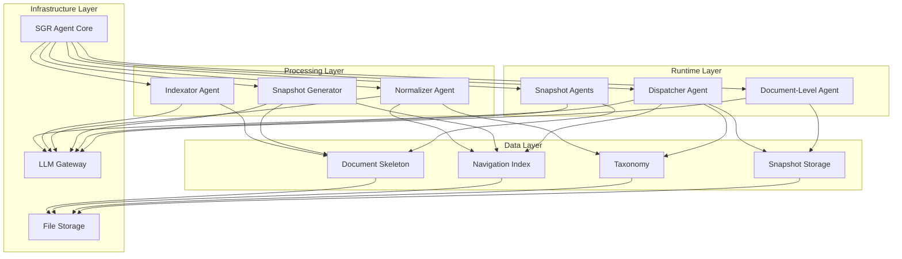
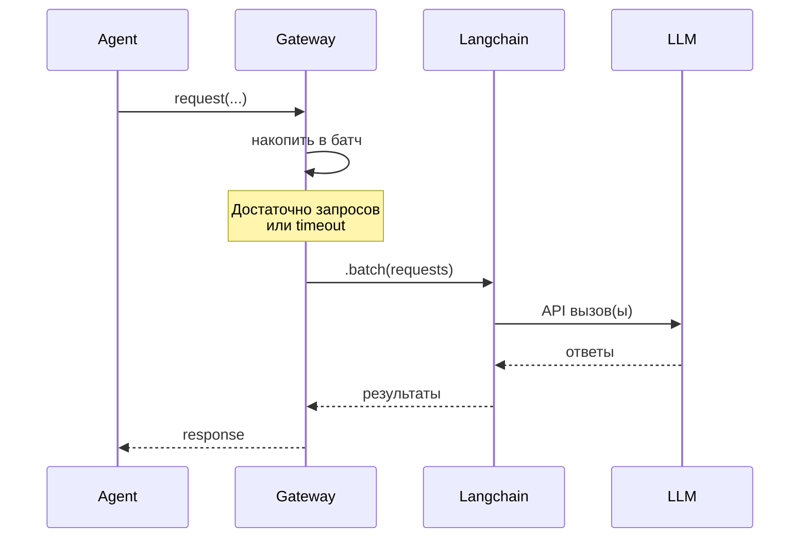
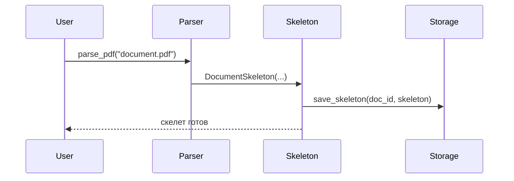
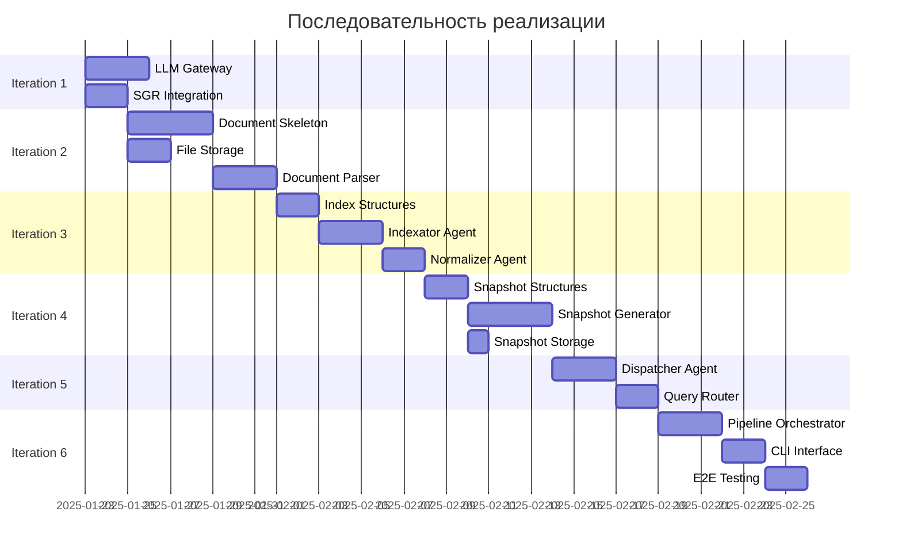

# Implementation Plan: Agentic Document Processing System

**Версия:** 1.1
**Дата:** 2025-01-23
**Статус:** Базовый план для реализации

---

## Цель

Создать систему для глубокого анализа больших документов (сотни страниц) с помощью AI-агентов на основе фреймворка SGR (Schema-Guided Reasoning). Система должна обеспечивать:

- Извлечение информации и ответы на вопросы по содержанию документа
- Построение навигационного индекса по темам
- Создание тематических снэпшот-агентов
- Координацию агентов через LLM Gateway

**Ключевые приоритеты:** Точность и непротиворечивость > скорость. Время обработки не ограничено.

---

## Обзор модулей

### Архитектурная схема



### Описание модулей

**LLM Gateway**
- Назначение: Централизованный доступ к LLM с батчингом
- Зависимости: Langchain клиенты для каждого провайдера
- Предоставляет: Единый интерфейс для всех агентов

**SGR Agent Core Integration**
- Назначение: Базовый фреймворк для всех агентов
- Зависимости: sgr-agent-core (Python репозиторий)
- Предоставляет: Базовый класс для SGR-агентов

**Document Skeleton**
- Назначение: Хранение физической структуры документа
- Зависимости: File Storage
- Предоставляет: Интерфейс доступа к узлам документа

**Navigation Index**
- Назначение: Матрица "узел × тема" для навигации
- Зависимости: Document Skeleton, Taxonomy
- Предоставляет: Поиск релевантных узлов по теме

**Taxonomy**
- Назначение: Иерархическое дерево тем документа
- Зависимости: Отсутствуют
- Предоставляет: Интерфейс запроса тем и их иерархии

**Indexator Agent**
- Назначение: Построение навигационного индекса
- Зависимости: LLM Gateway, SGR Core, Document Skeleton
- Предоставляет: Сырые темы для нормализатора

**Normalizer Agent**
- Назначение: Нормализация таксономии
- Зависимости: LLM Gateway, SGR Core
- Предоставляет: Нормализованную таксономию

**Snapshot Generator**
- Назначение: Создание снэпшот-агентов
- Зависимости: LLM Gateway, SGR Core, Navigation Index
- Предоставляет: Готовые снэпшоты

**Dispatcher Agent**
- Назначение: Маршрутизация запросов пользователей
- Зависимости: LLM Gateway, SGR Core, Navigation Index, Taxonomy
- Предоставляет: Единая точка входа для запросов

**Snapshot Agents**
- Назначение: Тематические агенты с сохранённым контекстом
- Зависимости: LLM Gateway, SGR Core, Document Skeleton
- Предоставляет: Ответы на вопросы по теме

**Document-Level Agent**
- Назначение: Holistic анализ всего документа
- Зависимости: LLM Gateway, SGR Core, Snapshot Agents
- Предоставляет: Комплексный анализ, BPMN-генерация

---

## Итерация 1: Инфраструктурный слой

**Цель:** Создать фундамент для всех агентов - централизованный доступ к LLM и интеграцию SGR фреймворка.

**Модули для реализации:**
1. LLM Gateway
2. SGR Agent Core интеграция
3. Базовая структура проекта

### Интерфейсы

#### LLM Gateway

```python
from typing import List, Dict, Any, Optional, Protocol
from enum import Enum

class ModelProvider(str, Enum):
    CLAUDE_HAIKU = "claude-haiku"
    CLAUDE_SONNET = "claude-sonnet"
    CLAUDE_OPUS = "claude-opus"
    GPT_4O_MINI = "gpt-4o-mini"
    LOCAL_LLAMA = "local-llama"

class RequestPriority(int, Enum):
    HIGH = 1   # запросы от пользователя (runtime)
    NORMAL = 2 # Eager-генерация снэпшотов
    LOW = 3    # фоновая переиндексация

class LLMMessage:
    role: str  # "system" | "user" | "assistant"
    content: str

class LLMTool:
    name: str
    description: str
    input_schema: Dict[str, Any]

class LLMRequest:
    model: ModelProvider
    messages: List[LLMMessage]
    tools: Optional[List[LLMTool]] = None
    request_id: str
    priority: RequestPriority = RequestPriority.NORMAL
    temperature: float = 0.0
    max_tokens: Optional[int] = None

class LLMResponse:
    request_id: str
    content: str
    tool_calls: Optional[List[Dict[str, Any]]] = None
    model: str
    tokens_used: Optional[Dict[str, int]] = None

# Интерфейс Gateway
class LLMGateway:
    """
    Централизованный доступ к LLM.

    Архитектурный подход:
    - Использует Langchain клиенты для каждого провайдера
    - Батчинг через langchain .batch() методы
    - Retry с экспоненциальным backoff
    - Минимальная конфигурация (API keys, timeouts)
    """
    def __init__(self, config: Dict[str, Any]):
        """Инициализация Gateway с конфигурацией"""
        pass

    async def request(self, request: LLMRequest) -> LLMResponse:
        """Отправить запрос в LLM"""
        pass

    async def batch(self, requests: List[LLMRequest]) -> List[LLMResponse]:
        """Отправить батч запросов через Langchain"""
        pass

    async def shutdown(self):
        """Graceful shutdown"""
        pass

    def get_stats(self) -> Dict[str, Any]:
        """Статистика для мониторинга"""
        pass
```

**Примечание:** Детали реализации (конкретные таймауты, retry policy) определяются Analyst/Developer.

#### SGR Agent Core Integration

```python
from sgr_agent_core import SGRAgent, SGRAgentConfig

class SystemSGRAgent(SGRAgent):
    """
    Базовый класс для всех агентов системы.
    Наследует SGRAgent из фреймворка и добавляет:
    - Автоматическую интеграцию с LLM Gateway
    - Стандартное логирование reasoning
    """

    llm_gateway: LLMGateway

    def __init__(self, config: SGRAgentConfig, llm_gateway: LLMGateway):
        super().__init__(config)
        self.llm_gateway = llm_gateway

    async def call_llm(self, model: ModelProvider, **kwargs) -> LLMResponse:
        """Переопределяет метод call_llm для использования Gateway"""
        pass
```

**Стратегия моков для Итерации 1:**

- **LLM API:** MockLLMGateway с детерминированными ответами из fixtures
- **SGR Core:** Используем реальный фреймворк (внешняя зависимость)
- **Конфигурация:** Минимальная (API keys из env)

**Критерии готовности:**
- [ ] LLM Gateway реализован с batching через Langchain
- [ ] MockLLMGateway для тестирования
- [ ] SystemSGRAgent базовый класс
- [ ] Структура проекта: 02_src/, tests/, config/
- [ ] Логирование в 04_logs/gateway/
- [ ] Unit тесты для batching логики
- [ ] Можно увидеть работу через логи батчей

**Визуализация итерации:**



---

## Итерация 2: Слой данных (Document Skeleton)

**Цель:** Создать структуру для хранения и доступа к физической структуре документа.

**Модули для реализации:**
1. Document Skeleton (структуры данных и хранилище)
2. File Storage (простое файловое хранилище)
3. Парсер документов (базовый PDF/text)

### Интерфейсы

#### Document Skeleton

```python
from typing import List, Dict, Optional
from enum import Enum
from dataclasses import dataclass

class NodeType(str, Enum):
    CHAPTER = "chapter"
    SECTION = "section"
    APPENDIX = "appendix"
    TABLE = "table"
    FIGURE = "figure"
    ROOT = "root"

@dataclass
class PageRange:
    start: int
    end: int

@dataclass
class InternalStructure:
    """Иерархия подпунктов внутри узла"""
    raw: Dict[str, Any]

@dataclass
class Node:
    """Узел скелета документа"""
    id: str
    type: NodeType
    title: Optional[str]
    content: str
    page_range: PageRange
    parent_id: Optional[str]
    children_ids: List[str]
    internal_structure: InternalStructure
    explicit_refs: List[str]
    hash: str

class DocumentSkeleton:
    """Интерфейс доступа к скелету документа"""

    document_id: str

    async def get_node(self, node_id: str) -> Optional[Node]:
        """Получить узел по ID"""
        pass

    async def get_root(self) -> Node:
        """Получить корневой узел"""
        pass

    async def get_children(self, node_id: str) -> List[Node]:
        """Получить прямых потомков"""
        pass

    async def find_by_title(self, title_pattern: str) -> List[Node]:
        """Найти узлы по паттерну заголовка"""
        pass

    async def find_by_page_range(self, start: int, end: int) -> List[Node]:
        """Найти узлы по диапазону страниц"""
        pass

    async def resolve_reference(self, ref: str) -> Optional[Node]:
        """Резолв явной ссылки"""
        pass

    async def get_document_hash(self) -> str:
        """Хэш всего документа"""
        pass
```

#### File Storage

```python
from pathlib import Path

class FileStorage:
    """Файловое хранилище для скелетов и индексов"""

    base_path: Path

    async def save_skeleton(self, document_id: str, skeleton: DocumentSkeleton):
        """Сохранить скелет в JSON"""
        pass

    async def load_skeleton(self, document_id: str) -> Optional[DocumentSkeleton]:
        """Загрузить скелет из JSON"""
        pass

    def document_exists(self, document_id: str) -> bool:
        """Проверить существование документа"""
        pass
```

#### Document Parser

```python
class ParseResult:
    skeleton: DocumentSkeleton
    raw_text: str
    metadata: Dict[str, Any]

class DocumentParser:
    """Парсер документов"""

    async def parse_pdf(self, file_path: str) -> ParseResult:
        """Парсинг PDF файла"""
        pass

    async def parse_text(self, file_path: str) -> ParseResult:
        """Парсинг plain text файла"""
        pass
```

**Стратегия моков для Итерации 2:**

- **File Storage:** Временная директория `/tmp/doc_processing/`
- **Document Parser:** Test fixtures с готовым скелетом

**Критерии готовности:**
- [ ] DocumentSkeleton структуры данных реализованы
- [ ] FileStorage для сохранения/загрузки скелетов
- [ ] DocumentParser для базового PDF/text
- [ ] Тестовый документ с корректным скелетом
- [ ] Unit тесты для всех методов DocumentSkeleton
- [ ] Интеграционные тесты: парсинг → скелет → сохранение → загрузка

**Визуализация итерации:**



---

## Итерация 3: Индексация (Navigation Index & Taxonomy)

**Цель:** Создать навигационный индекс и таксономию для поиска по темам.

**Модули для реализации:**
1. Navigation Index (структуры данных)
2. Taxonomy (структуры данных)
3. Indexator Agent (SGR-агент)
4. Normalizer Agent (SGR-агент)

### Интерфейсы

#### Navigation Index & Taxonomy

```python
from typing import Dict, List, Set

@dataclass
class Signal:
    """Сигнал в матрице индекса"""
    content_description: str
    sub_references: List[str]

@dataclass
class TopicNode:
    """Узел таксономии"""
    id: str
    name: str
    aliases: Set[str]
    parent_id: Optional[str]
    children_ids: List[str]

class Taxonomy:
    """Иерархическое дерево тем"""

    version: str

    async def get_topic(self, topic_id: str) -> Optional[TopicNode]:
        pass

    async def get_root_topics(self) -> List[TopicNode]:
        pass

    async def get_children(self, topic_id: str) -> List[TopicNode]:
        pass

class NavigationIndex:
    """Матрица "узел × тема" для навигации"""

    document_id: str
    taxonomy_version: str
    matrix: Dict[str, Dict[str, Signal]]

    async def get_relevant_nodes(self, topic_id: str) -> Dict[str, Signal]:
        """Получить узлы релевантные теме"""
        pass

    async def find_relevant_content(
        self,
        topic_id: str,
        skeleton: DocumentSkeleton
    ) -> List[tuple[Node, Signal]]:
        """Найти релевантный контент по теме"""
        pass
```

#### Indexator/Normalizer Agents

```python
class IndexatorAgent(SystemSGRAgent):
    """SGR-агент для построения навигационного индекса"""

    async def build_index(self) -> tuple[NavigationIndex, Taxonomy]:
        """Построить навигационный индекс"""
        pass

class NormalizerAgent(SystemSGRAgent):
    """SGR-агент для нормализации таксономии"""

    async def normalize_taxonomy(self, raw_topics: Dict[str, str]) -> Taxonomy:
        """Нормализовать таксономию"""
        pass
```

**Критерии готовности:**
- [ ] NavigationIndex и Taxonomy структуры данных
- [ ] IndexatorAgent реализован как SGR-агент
- [ ] NormalizerAgent реализован как SGR-агент
- [ ] Параллельная обработка узлов через Gateway
- [ ] Логи SGR-ризонинга в 04_logs/reasoning/

---

## Итерация 4: Snapshot-агенты

**Цель:** Создать механизм генерации снэпшот-агентов по темам.

**Модули для реализации:**
1. Snapshot Agent (структура и SGR-агент)
2. Snapshot Generator
3. Snapshot Storage

### Интерфейсы

```python
from datetime import datetime
from enum import Enum

class SnapshotAgentStatus(str, Enum):
    ACTIVE = "active"
    STALE = "stale"

@dataclass
class SourceVersion:
    """Метаданные для инвалидации"""
    document_hash: str
    nodes_hashes: Dict[str, str]
    created_at: datetime

@dataclass
class SnapshotContext:
    """Накопленный контекст снэпшота"""
    summary: str
    source_nodes: List[str]
    scope_description: str

class SnapshotAgent(SystemSGRAgent):
    """Снэпшот-агент с сохранённым контекстом"""

    id: str
    document_id: str
    topic_id: str
    context: SnapshotContext
    source_version: SourceVersion
    status: SnapshotAgentStatus

    async def query(self, user_message: str) -> str:
        """Ответить на вопрос"""
        pass

    async def is_stale(self, current_skeleton: DocumentSkeleton) -> bool:
        """Проверить актуальность"""
        pass

class SnapshotGenerator:
    """Генератор снэпшотов"""

    async def generate_snapshot(
        self,
        topic_id: str,
        nav_index: NavigationIndex
    ) -> SnapshotAgent:
        """Сгенерировать снэпшот"""
        pass

class SnapshotStorage:
    """Хранилище снэпшотов"""

    async def save_snapshot(self, snapshot: SnapshotAgent):
        pass

    async def load_snapshot(
        self,
        document_id: str,
        topic_id: str
    ) -> Optional[SnapshotAgent]:
        pass
```

**Критерии готовности:**
- [ ] SnapshotAgent структура и SGR-реализация
- [ ] SnapshotGenerator для создания снэпшотов
- [ ] SnapshotStorage для персистентности
- [ ] Инвалидация снэпшотов при изменениях
- [ ] Логи SGR-ризонинга снэпшотов

---

## Итерация 5: Runtime (Dispatcher Agent)

**Цель:** Создать единый интерфейс для запросов пользователей.

**Модули для реализации:**
1. Dispatcher Agent (SGR-агент)
2. Query Router

### Интерфейсы

```python
class QueryType(str, Enum):
    QUESTION = "question"
    ANALYSIS = "analysis"
    META = "meta"

@dataclass
class QueryContext:
    query: str
    query_type: QueryType
    relevant_topics: List[str]

class DispatcherAgent(SystemSGRAgent):
    """Центральный агент-маршрутизатор"""

    async def handle_query(self, user_query: str) -> str:
        """Обработать запрос пользователя"""
        pass

    async def _classify_query(self, query: str) -> QueryType:
        """Классифицировать запрос"""
        pass

    async def _get_or_create_snapshot(
        self,
        topic_id: str
    ) -> Optional[SnapshotAgent]:
        """Получить или создать снэпшот (lazy)"""
        pass
```

**Критерии готовности:**
- [ ] DispatcherAgent реализован как SGR-агент
- [ ] Классификация запросов
- [ ] Lazy-генерация снэпшотов
- [ ] Диалоговое взаимодействие

---

## Итерация 6: End-to-End Pipeline

**Цель:** Объединить все модули в полный пайплайн.

**Модули для реализации:**
1. Pipeline Orchestrator
2. CLI / REPL интерфейс

### Интерфейсы

```python
@dataclass
class IngestionResult:
    document_id: str
    skeleton: DocumentSkeleton
    nav_index: NavigationIndex
    taxonomy: Taxonomy
    eager_snapshots: Dict[str, SnapshotAgent]

class PipelineOrchestrator:
    """Оркестратор полного пайплайна"""

    async def ingest_document(
        self,
        file_path: str,
        start_topics: Optional[List[str]] = None
    ) -> IngestionResult:
        """Полный цикл обработки документа"""
        pass

    async def query_document(
        self,
        document_id: str,
        query: str
    ) -> str:
        """Запрос к документу"""
        pass

class DocumentProcessingCLI:
    """CLI для взаимодействия"""

    async def load_document(self, file_path: str):
        pass

    async def query(self, query: str):
        pass

    async def interactive_mode(self):
        pass
```

**Критерии готовности:**
- [ ] PipelineOrchestrator реализован
- [ ] Полный цикл: PDF → скелет → индекс → снэпшоты
- [ ] CLI для загрузки документа
- [ ] Интерактивный REPL
- [ ] E2E тест с реальным документом

---

## Итерация 7: Document-Level Agent (опционально)

**Цель:** Реализовать агент уровня документа для комплексного анализа.

**Модули для реализации:**
1. Document-Level Agent (SGR с сильной моделью)
2. BPMN Generation Tools

### Интерфейсы

```python
class DocumentLevelAgent(SystemSGRAgent):
    """Агент уровня документа для holistic анализа"""

    async def analyze_whole_document(self, task: str) -> str:
        """Комплексный анализ всего документа"""
        pass

    async def _query_snapshots_about(self, topic: str) -> Dict[str, str]:
        """Опросить все снэпшоты"""
        pass
```

**Критерии готовности:**
- [ ] DocumentLevelAgent с сильной моделью
- [ ] Координация снэпшотов
- [ ] BPMN generation tools

---

## Критический путь



**Критическая цепочка:**
1. LLM Gateway + SGR Integration (фундамент)
2. Document Skeleton → Navigation Index → Snapshot Generator
3. Dispatcher Agent → Pipeline Orchestrator
4. CLI Interface → E2E Testing

**Параллельные работы:**
- Итерация 1: LLM Gateway и SGR Integration можно делать параллельно
- Итерация 2: File Storage параллельно с Document Skeleton
- Итерация 7: Document-Level Agent независим от E2E тестов

---

## Интерфейсы между модулями

### LLM Gateway ↔ SGR Agents

```python
interface ILLMRequester {
    async def request(request: LLMRequest) -> LLMResponse
    async def batch(requests: List[LLMRequest]) -> List[LLMResponse]
}
```

**Гарантии:**
- Gateway batches запросы через Langchain
- Retry с exponential backoff
- Асинхронные операции

### Document Skeleton ↔ Navigation Index

```python
interface INodeProvider {
    async def get_node(node_id: str) -> Optional[Node]
    async def get_children(node_id: str) -> List[Node]
}
```

### Navigation Index ↔ Snapshot Generator

```python
interface ITopicIndex {
    async def get_relevant_nodes(topic_id: str) -> Dict[str, Signal]
}
```

### Snapshot Agent ↔ Snapshot Agent

```python
interface IAgentCommunication {
    async def ask_agent(agent_id: str, question: str) -> str
}
```

---

## Стратегия наблюдаемости

### Логирование

```
04_logs/
├── app.log              # основной лог
├── llm_calls.log        # JSON логи LLM запросов
├── gateway/             # логи Gateway
└── reasoning/           # SGR-ризонинг по агентам
```

### Метрики

```python
class MetricsCollector:
    async def record_llm_request(model: str, latency_ms: int, tokens: int):
        pass

    async def record_agent_reasoning(agent_id: str, steps: int, tools: List[str]):
        pass
```

---

## TBD вопросы из архитектуры

| TBD | Область | Когда решать |
|-----|---------|--------------|
| TBD-001 | Инкрементальность снэпшотов | После реализации snapshot-агентов |
| TBD-002 | Мэппинг таксономий | При cross-document сценариях |
| TBD-003 | Инвалидация cross-document | При cross-document сценариях |
| TBD-004 | Неявные ссылки | По необходимости |
| TBD-005 | Выявление противоречий | После накопления базы |

Эти вопросы **не блокируют** начало реализации.

---

## Что НЕ включать в план

❌ Детали реализации SGR tools (для Analyst)
❌ Конкретные промпты для агентов (для Analyst)
❌ Детали конфигурации (timeouts, retry policy - для Analyst/Developer)
❌ Архитектурные решения (в ADR)
✅ Порядок реализации
✅ Интерфейсы и контракты
✅ Стратегия моков
✅ Критический путь
✅ Визуализация архитектуры
