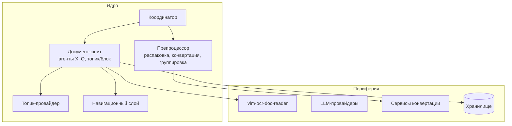
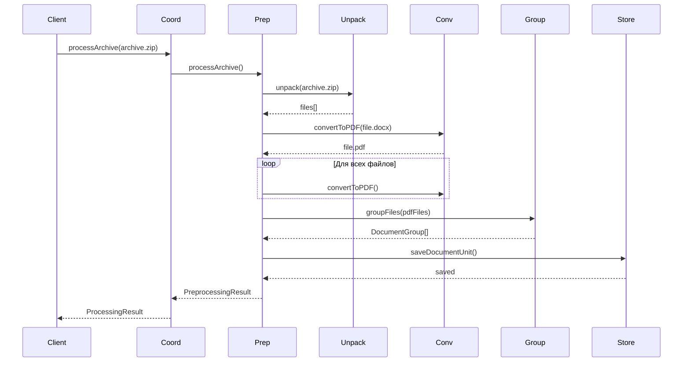
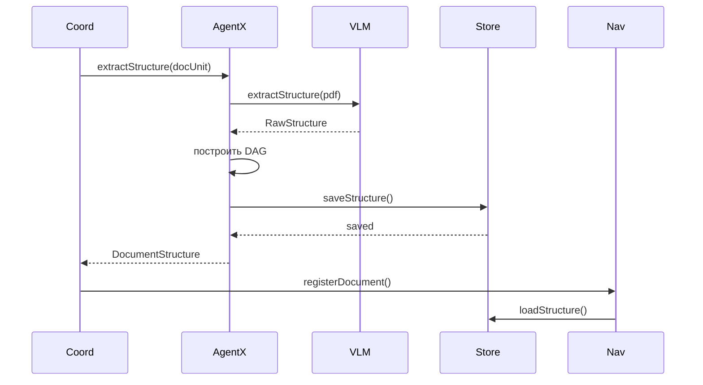
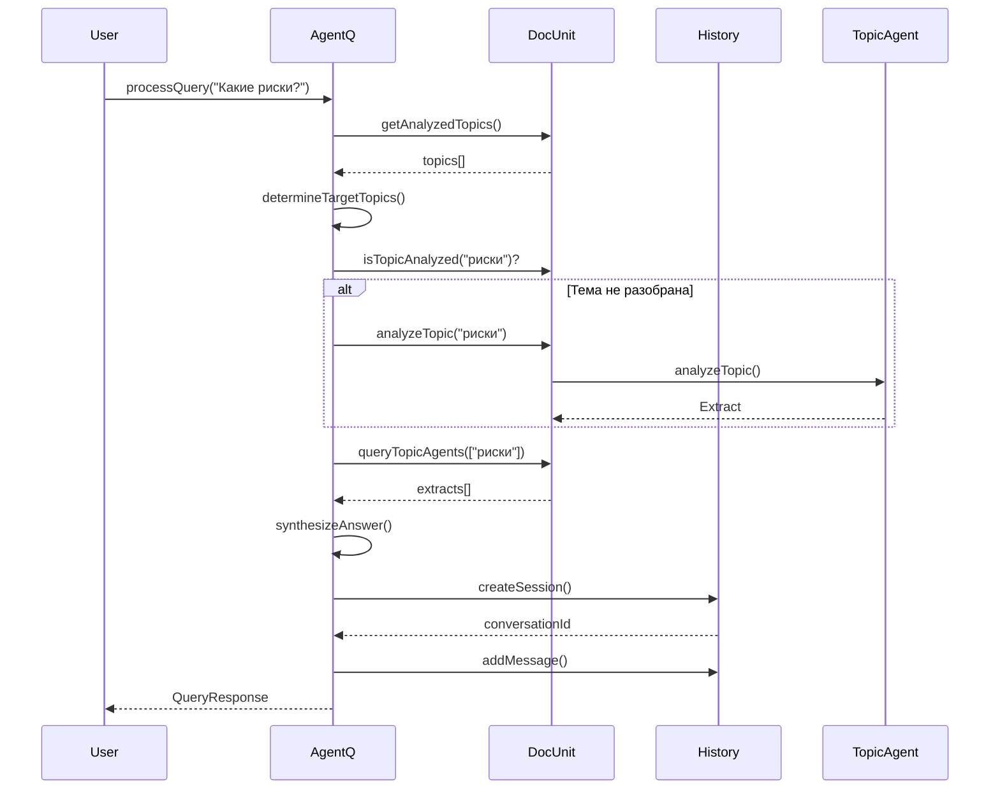
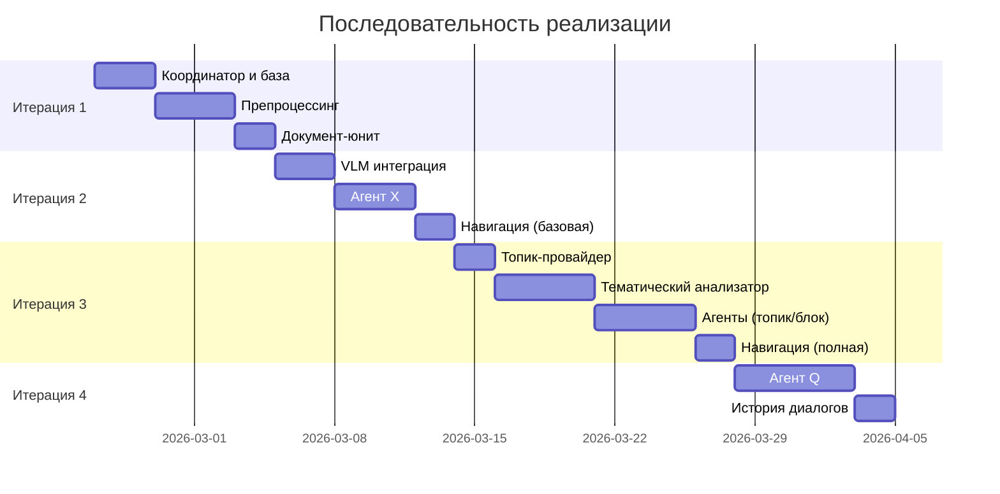

# Implementation Plan: Agentic Document Processing System

**Версия:** 0.1
**Дата:** 2026-02-24
**Автор:** Tech Lead

---

## Цель

Реализовать систему для интеллектуальной обработки документов с использованием иерархии LLM-агентов. Система должна обеспечивать:
- Приём и нормализацию архивов с документами (DOCX → PDF конвертация)
- Структурный анализ документов через vlm-ocr-doc-reader
- Тематический разбор с формированием навигационной матрицы
- Агентскую модель для ответов на вопросы по документам

**Ключевые требования:**
- Итеративная разработка с ценностью на каждом этапе
- Минимизация внешних зависимостей на ранних этапах
- Наблюдаемость системы через логи и визуализацию

---

## Обзор модулей

### Архитектурная схема


```mermaid
flowchart TB
    subgraph Core["Ядро"]
        Coord[Координатор]
        Prep[Препроцессор<br/>распаковка, конвертация, группировка]
        DocUnit[Документ-юнит<br/>агенты X, Q, топик/блок]
        TP[Топик-провайдер]
        Nav[Навигационный слой]
    end

    subgraph Periphery["Периферия"]
        VLM[vlm-ocr-doc-reader]
        LLM[LLM-провайдеры]
        Conv[Сервисы конвертации]
        Store[(Хранилище)]
    end

    Coord --> Prep
    Coord --> DocUnit
    DocUnit --> TP
    DocUnit --> Nav
    DocUnit --> VLM
    DocUnit --> Store
    Prep --> Conv
```

### Описание модулей

**Координатор**
- Назначение: Точка входа, оркестрация обработки документов
- Зависимости: Препроцессор, Документ-юнит
- Предоставляет: API для приёма архивов и запросов

**Препроцессор**
- Назначение: Распаковка архивов, конвертация DOCX → PDF, группировка файлов
- Зависимости: Сервисы конвертации, VLM-клиент
- Предоставляет: Документ-юниты с нормализованными файлами

**Документ-юнит**
- Назначение: Агрегация файлов документа, хранение артефактов, обработка запросов
- Зависимости: vlm-ocr-doc-reader, Хранилище
- Предоставляет: Контейнер для PDF, структуры, матрицы, выписок

**Топик-провайдер**
- Назначение: Поставляет темы для разбора (опционально)
- Зависимости: —
- Предоставляет: Список тем по типу документа

**Навигационный слой**
- Назначение: Оглавление, поиск по блокам, навигационная матрица, выписки
- Зависимости: Документ-юнит
- Предоставляет: API для навигации по документу

---

## Итерация 1: Препроцессинг

**Цель:** Создать базовую инфраструктуру для приёма и нормализации документов

**Модули для реализации:**
1. Координатор (базовый)
2. Препроцессор
3. Распаковщик
4. Конвертер
5. Группировщик
6. Документ-юнит (пустой)
7. Хранилище (базовое)

**Интерфейсы:**

### Координатор

```typescript
// Основной интерфейс координатора
interface Coordinator {
  // Приём архива на обработку
  processArchive(archivePath: string, options?: ProcessOptions): Promise<ProcessingResult>;
}

interface ProcessOptions {
  docType?: string;          // Опциональный тип документа
  question?: string;         // Опциональный вопрос
  topicProvider?: string;    // Опциональный провайдер тем
}

interface ProcessingResult {
  documentUnits: DocumentUnit[];
  registry: DocumentRegistry;
}
```

### Препроцессор

```typescript
interface Preprocessor {
  // Оркестрация препроцессинга
  processArchive(archivePath: string): Promise<PreprocessingResult>;
}

interface PreprocessingResult {
  documentUnits: DocumentUnit[];
  fileMapping: FileMapping;    // файлы → документы
  errors: ProcessingError[];
}
```

### Распаковщик

```typescript
interface Unpacker {
  // Распаковка ZIP-архива
  unpack(archivePath: string): Promise<UnpackedFiles>;
}

interface UnpackedFiles {
  files: string[];  // Пути к распакованным файлам
}
```

### Конвертер

```typescript
interface Converter {
  // Конвертация DOCX → PDF
  convertToPDF(filePath: string): Promise<PDFFile>;
  // Проверка формата
  isConvertible(filePath: string): boolean;
}

interface PDFFile {
  path: string;
  originalPath: string;
  metadata: FileMetadata;
}
```

### Группировщик

```typescript
interface Grouper {
  // Определение принадлежности файлов к документам
  groupFiles(files: string[]): Promise<DocumentGroup[]>;
}

interface DocumentGroup {
  id: string;
  files: string[];
  docType: string;
  confidence: number;
}
```

### Документ-юнит (базовый)

```typescript
interface DocumentUnit {
  id: string;
  files: PDFFile[];
  docType: string;
  createdAt: Date;

  // Базовые методы
  addFile(file: PDFFile): void;
  getFiles(): PDFFile[];
}
```

### Хранилище (базовое)

```typescript
interface Storage {
  // Сохранение документ-юнита
  saveDocumentUnit(unit: DocumentUnit): Promise<void>;
  // Загрузка документ-юнита
  loadDocumentUnit(id: string): Promise<DocumentUnit | null>;
  // Реестр документов
  getRegistry(): DocumentRegistry;
}
```

**Стратегия моков для Итерации 1:**
- **Сервисы конвертации:** Mock-конвертер (возвращает PDF-файлы-заглушки)
- **VLM-клиент:** Mock-группировщик (простая логика по именам файлов)
- **Хранилище:** Файловое хранилище в JSON формате

**Критерии готовности:**
- [ ] Координатор принимает ZIP-архив
- [ ] Препроцессор распаковывает архив
- [ ] Конвертер конвертирует DOCX → PDF (с моком)
- [ ] Группировщик определяет принадлежность файлов к документам
- [ ] Создаются Документ-юниты с PDF-файлами
- [ ] Реестр документов сохраняется в хранилище
- [ ] Логирование каждого этапа обработки
- [ ] Интеграционные тесты: ZIP → Документ-юниты

**Визуализация итерации:**


```mermaid
sequenceDiagram
    participant Client
    participant Coord
    participant Prep
    participant Unpack
    participant Conv
    participant Group
    participant Store

    Client->>Coord: processArchive(archive.zip)
    Coord->>Prep: processArchive()
    Prep->>Unpack: unpack(archive.zip)
    Unpack-->>Prep: files[]
    Prep->>Conv: convertToPDF(file.docx)
    Conv-->>Prep: file.pdf
    loop Для всех файлов
        Prep->>Conv: convertToPDF()
    end
    Prep->>Group: groupFiles(pdfFiles)
    Group-->>Prep: DocumentGroup[]
    Prep->>Store: saveDocumentUnit()
    Store-->>Prep: saved
    Prep-->>Coord: PreprocessingResult
    Coord-->>Client: ProcessingResult
```

---

## Итерация 2: Структура

**Цель:** Извлечь структуру документа: DAG блоков и оглавление

**Модули для реализации:**
1. Агент X (структурный экстрактор)
2. Интеграция с vlm-ocr-doc-reader
3. Хранилище (структуры)
4. Навигационный слой (базовый)

**Интерфейсы:**

### Агент X

```typescript
interface AgentX {
  // Извлечение структуры документа
  extractStructure(docUnit: DocumentUnit): Promise<DocumentStructure>;
}

interface DocumentStructure {
  blocks: Block[];          // DAG блоков
  toc: TableOfContents;     // Оглавление
  metadata: StructureMetadata;
}

interface Block {
  id: string;
  type: BlockType;          // section, subsection, paragraph, etc.
  title?: string;
  level: number;            // 1, 2, 3... для иерархии
  pageRange: PageRange;
  children?: Block[];       // Подблоки
  parent?: string;          // ID родительского блока
}

interface TableOfContents {
  entries: TOCEntry[];
}

interface TOCEntry {
  title: string;
  level: number;
  blockId: string;
  pageNumber: number;
}
```

### VLM-клиент

```typescript
interface VLMClient {
  // Извлечение контента страниц
  extractPages(pdfPath: string, pages: number[]): Promise<PageContent[]>;

  // Извлечение структуры
  extractStructure(pdfPath: string): Promise<RawStructure>;
}

interface PageContent {
  pageNumber: number;
  text: string;
  layout: LayoutInfo;
}

interface RawStructure {
  headers: Header[];
  sections: SectionInfo[];
}
```

### Хранилище (структуры)

```typescript
interface StorageStructure extends Storage {
  // Сохранение структуры документа
  saveStructure(docId: string, structure: DocumentStructure): Promise<void>;
  // Загрузка структуры
  loadStructure(docId: string): Promise<DocumentStructure | null>;
}
```

### Навигационный слой (базовый)

```typescript
interface NavigationLayer {
  // Получение оглавления
  getTableOfContents(docId: string): Promise<TableOfContents>;

  // Поиск блоков по уровню
  getBlocksByLevel(docId: string, level: number): Promise<Block[]>;

  // Получение поддерева блоков
  getBlockTree(docId: string): Promise<Block[]>;
}
```

**Стратегия моков для Итерации 2:**
- **vlm-ocr-doc-reader:** Mock VLM-клиент (возвращает тестовую структуру)
- **LLM-провайдеры:** Не используются на этом этапе

**Критерии готовности:**
- [ ] Агент X извлекает структуру через VLM
- [ ] DAG блоков построен корректно (проверка иерархии)
- [ ] Оглавление соответствует разделам документа
- [ ] Структура сохранена в хранилище
- [ ] Навигационный слой предоставляет API для оглавления
- [ ] Логирование этапов извлечения
- [ ] Тесты: PDF → DocumentStructure

**Визуализация итерации:**


```mermaid
sequenceDiagram
    participant Coord
    participant AgentX
    participant VLM
    participant Store
    participant Nav

    Coord->>AgentX: extractStructure(docUnit)
    AgentX->>VLM: extractStructure(pdf)
    VLM-->>AgentX: RawStructure
    AgentX->>AgentX: построить DAG
    AgentX->>Store: saveStructure()
    Store-->>AgentX: saved
    AgentX-->>Coord: DocumentStructure
    Coord->>Nav: registerDocument()
    Nav->>Store: loadStructure()
```

---

## Итерация 3: Тематическая обработка

**Цель:** Разбор документа по темам: навигационная матрица и выписки

**Модули для реализации:**
1. Топик-провайдер (опционально)
2. Тематический анализатор
3. Топик-агент
4. Блок-агент
5. Навигационный слой (полный)
6. Хранилище (тема/матрица)

**Интерфейсы:**

### Топик-провайдер

```typescript
interface TopicProvider {
  // Получение тем для типа документа
  getTopics(docType: string): Promise<Topic[]>;

  // Получение всех поддерживаемых типов
  getSupportedTypes(): string[];
}

interface Topic {
  id: string;
  name: string;
  description: string;
  query: string;            // Запрос для LLM
}
```

### Тематический анализатор

```typescript
interface ThematicAnalyzer {
  // Разбор документа по темам
  analyzeByTopics(
    docUnit: DocumentUnit,
    topics: Topic[]
  ): Promise<NavigationMatrix>;

  // Получение выписки по теме
  getExtract(docId: string, topicId: string): Promise<Extract>;
}

interface NavigationMatrix {
  docId: string;
  topics: Topic[];
  cells: MatrixCell[][];     // [topicIndex][blockIndex]
  analyzedTopics: Set<TopicID>;
}
```

### Топик-агент

```typescript
interface TopicAgent {
  // Разбор одной темы
  analyzeTopic(
    topic: Topic,
    blocks: Block[]
  ): Promise<Extract>;

  // Создание блок-агентов
  createBlockAgents(topic: Topic): BlockAgent[];
}
```

### Блок-агент

```typescript
interface BlockAgent {
  // Извлечение данных по теме из блока
  extractFromBlock(
    topic: Topic,
    block: Block
  ): Promise<CellContent>;
}

interface CellContent {
  hasInfo: boolean;
  summary?: string;          // Краткое описание
    details?: string;         // Детали
    confidence: number;
}
```

### Навигационный слой (полный)

```typescript
interface NavigationLayerFull extends NavigationLayer {
  // Получение навигационной матрицы
  getNavigationMatrix(docId: string): Promise<NavigationMatrix>;

  // Поиск блоков по теме
  findBlocksByTopic(docId: string, topicId: string): Promise<Block[]>;

  // Получение выписки
  getExtract(docId: string, topicId: string): Promise<Extract>;
}

interface Extract {
  topicId: string;
  topicName: string;
  summary: string;
  relevantBlocks: BlockReference[];
  details: ExtractDetail[];
}
```

### Хранилище (тема/матрица)

```typescript
interface StorageTopics extends StorageStructure {
  // Сохранение навигационной матрицы
  saveMatrix(matrix: NavigationMatrix): Promise<void>;

  // Сохранение выписки
  saveExtract(docId: string, extract: Extract): Promise<void>;

  // Загрузка матрицы
  loadMatrix(docId: string): Promise<NavigationMatrix | null>;
}
```

**Инициирование разбора:**

**Способ A: Через Топик-провайдер**
```typescript
// API запрос
POST /api/documents/{doc_id}/process
Body: {
  "topic_provider": "default"
}

Координатор → Документ-юнит:
  process(files, doc_type, topic_provider)

Документ-юнит → Топик-провайдер: get_topics(docType)
Документ-юнит → Тематический анализатор: analyzeByTopics()
```

**Способ B: Через API запрос**
```typescript
POST /api/documents/{doc_id}/topics
Body: { "topics": ["риски", "обязательства", "..."] }

Документ-юнит → Тематический анализатор: analyzeByTopics()
```

**Стратегия моков для Итерации 3:**
- **Топик-провайдер:** In-memory список тем (если не реализован)
- **LLM-провайдеры:** Mock LLM (возвращает тестовые выписки)
- **vlm-ocr-doc-reader:** Reuse из Итерации 2

**Критерии готовности:**
- [ ] Тематический анализатор создаёт топик-агентов
- [ ] Топик-агент создаёт блок-агентов
- [ ] Блок-агенты извлекают данные через VLM
- [ ] Навигационная матрица построена (минимум 1 тема)
- [ ] Каждая ячейка заполнена (описание или "не отражено")
- [ ] Выписки созданы и сохранены
- [ ] Навигационный слой предоставляет API для матрицы и выписок
- [ ] Тесты: DocumentStructure → NavigationMatrix + Extracts

**Визуализация итерации:**

```mermaid
sequenceDiagram
    participant Coord
    participant DocUnit
    participant TP
    participant TA
    participant TopicAgent
    participant BlockAgent
    participant VLM

    Coord->>DocUnit: process(files, docType, topicProvider)
    DocUnit->>TP: getTopics(docType)
    TP-->>DocUnit: topics[]
    DocUnit->>TA: analyzeByTopics(topics)

    par Параллельный разбор тем
        TA->>TopicAgent: analyzeTopic(topic1)
        TopicAgent->>BlockAgent: extractFromBlock(block1)
        BlockAgent->>VLM: query(topic, block)
        VLM-->>BlockAgent: CellContent
        BlockAgent-->>TopicAgent: result
        loop Все блоки
            TopicAgent->>BlockAgent: extractFromBlock()
        end
        TopicAgent-->>TA: Extract
    и
        TA->>TopicAgent: analyzeTopic(topic2)
        TopicAgent->>BlockAgent: extractFromBlock()
    end

    TA-->>DocUnit: NavigationMatrix
```

---

## Итерация 4: Ответы на вопросы

**Цель:** Реализовать Агента Q для обработки пользовательских запросов

**Модули для реализации:**
1. Агент Q
2. История Агента Q

**Интерфейсы:**

### Агент Q

```typescript
interface AgentQ {
  // Обработка пользовательского запроса
  processQuery(
    query: string,
    docId: string,
    context?: ConversationContext
  ): Promise<QueryResponse>;

  // Повторный запрос с историей
  processFollowUp(
    query: string,
    conversationId: string
  ): Promise<QueryResponse>;
}

interface QueryResponse {
  answer: string;
  relevantTopics: Topic[];
  sources: BlockReference[];
  confidence: number;
  conversationId: string;
}
```

### История Агента Q

```typescript
interface ConversationHistory {
  // Создание новой сессии
  createSession(docId: string): Promise<ConversationID>;

  // Добавление сообщения
  addMessage(
    conversationId: string,
    message: ConversationMessage
  ): Promise<void>;

  // Получение истории
  getHistory(conversationId: string): Promise<ConversationMessage[]>;

  // Получение профиля сессии
  getSession(conversationId: string): Promise<ConversationSession | null>;
}

interface ConversationMessage {
  role: 'user' | 'assistant';
  content: string;
  timestamp: Date;
  relevantTopics?: Topic[];
}

interface ConversationSession {
  id: string;
  docId: string;
  messages: ConversationMessage[];
  analyzedTopics: Set<TopicID>;
}
```

### Логика работы Агента Q

**Сценарий A: Первичный запрос**

```typescript
async processPrimaryQuery(query: string, docUnit: DocumentUnit): Promise<QueryResponse> {
  // 1. Получить Т1 (разобранные темы) или TopicProvider
  const availableTopics = await docUnit.getAnalyzedTopics();

  // 2. Определить Т_целевые = релевантные темы для ответа
  const targetTopics = await this.determineTargetTopics(query, availableTopics);

  // 3. Инициировать разбор Т_целевых (если не разобраны)
  for (const topic of targetTopics) {
    if (!docUnit.isTopicAnalyzed(topic.id)) {
      await docUnit.analyzeTopic(topic);
    }
  }

  // 4. Опросить топик-агентов по Т_целевым
  const topicResponses = await this.queryTopicAgents(targetTopics, query);

  // 5. Синтезировать ответ на основе выписок
  const answer = await this.synthesizeAnswer(query, topicResponses);

  return answer;
}
```

**Сценарий B: Повторный запрос**

```typescript
async processFollowUpQuery(
  query: string,
  conversationId: string
): Promise<QueryResponse> {
  // 1. Получить историю
  const session = await this.history.getSession(conversationId);

  // 2. Определить Т_готовые = нужные ∩ Т_разобранные
  const targetTopics = await this.determineTargetTopics(query, session.analyzedTopics);

  // 3. Определить Т_доразобрать = нужные \ Т_разобранные
  const needAnalysis = targetTopics.filter(t => !session.analyzedTopics.has(t.id));

  // 4. Инициировать разбор Т_доразобрать
  for (const topic of needAnalysis) {
    await this.docUnit.analyzeTopic(topic);
    session.analyzedTopics.add(topic.id);
  }

  // 5. Опросить топик-агентов
  const topicResponses = await this.queryTopicAgents(targetTopics, query);

  // 6. Синтезировать ответ с учётом истории
  const answer = await this.synthesizeAnswer(query, topicResponses, session.messages);

  return answer;
}
```

**Стратегия моков для Итерации 4:**
- **LLM-провайдеры:** Mock LLM (возвращает тестовые ответы)
- Reuse всех компонентов из предыдущих итераций

**Критерии готовности:**
- [ ] Агент Q определяет целевые темы из запроса
- [ ] Агент Q инициирует разбор тем если нужно
- [ ] Агент Q опрашивает топик-агентов
- [ ] Агент Q синтезирует ответ на основе выписок
- [ ] История диалога сохраняется между запросами
- [ ] API для обработки запросов (первичных и follow-up)
- [ ] Тесты: query → answer с матрицей

**Визуализация итерации:**


```mermaid
sequenceDiagram
    participant User
    participant AgentQ
    participant DocUnit
    participant History
    participant TopicAgent

    User->>AgentQ: processQuery("Какие риски?")
    AgentQ->>DocUnit: getAnalyzedTopics()
    DocUnit-->>AgentQ: topics[]

    AgentQ->>AgentQ: determineTargetTopics()
    AgentQ->>DocUnit: isTopicAnalyzed("риски")?

    alt Тема не разобрана
        AgentQ->>DocUnit: analyzeTopic("риски")
        DocUnit->>TopicAgent: analyzeTopic()
        TopicAgent-->>DocUnit: Extract
    end

    AgentQ->>DocUnit: queryTopicAgents(["риски"])
    DocUnit-->>AgentQ: extracts[]

    AgentQ->>AgentQ: synthesizeAnswer()

    AgentQ->>History: createSession()
    History-->>AgentQ: conversationId
    AgentQ->>History: addMessage()

    AgentQ-->>User: QueryResponse
```

---

## Критический путь


```mermaid
gantt
    title Последовательность реализации
    dateFormat YYYY-MM-DD
    section Итерация 1
    Координатор и база           :i1m1, 2026-02-24, 3d
    Препроцессинг                :i1m2, after i1m1, 4d
    Документ-юнит                :i1m3, after i1m2, 2d
    section Итерация 2
    VLM интеграция               :i2m1, after i1m3, 3d
    Агент X                      :i2m2, after i2m1, 4d
    Навигация (базовая)          :i2m3, after i2m2, 2d
    section Итерация 3
    Топик-провайдер              :i3m1, after i2m3, 2d
    Тематический анализатор      :i3m2, after i3m1, 5d
    Агенты (топик/блок)          :i3m3, after i3m2, 5d
    Навигация (полная)           :i3m4, after i3m3, 2d
    section Итерация 4
    Агент Q                      :i4m1, after i3m4, 6d
    История диалогов             :i4m2, after i4m1, 2d
```

**Критическая цепочка:**
1. **Итерация 1:** Координатор → Препроцессор → Документ-юнит (базовый)
2. **Итерация 2:** VLM-клиент → Агент X → Навигация (базовая)
3. **Итерация 3:** Тематический анализатор → Агенты → Навигация (полная)
4. **Итерация 4:** Агент Q → История

**Параллельные работы:**
- **Итерация 2:** VLM-клиент можно разрабатывать параллельно с базовой структурой
- **Итерация 3:** Топик-провайдер можно разрабатывать параллельно с Тематическим анализатором
- **Итерация 4:** Историю диалогов можно разрабатывать параллельно с Агентом Q

---

## Интерфейсы между модулями

### Координатор ↔ Препроцессор

```typescript
interface CoordinatorPreprocessor {
  processArchive(archivePath: string): Promise<PreprocessingResult>;
}

interface PreprocessingResult {
  documentUnits: DocumentUnit[];
  fileMapping: FileMapping;
  errors: ProcessingError[];
}
```

**Гарантии:**
- Препроцессор не вызывает Координатор
- Все файлы сконвертированы в PDF
- Документ-юниты созданы даже при частичных ошибках

### Препроцессор ↔ Документ-юнит

```typescript
interface PreprocessorDocumentUnit {
  createDocumentUnit(group: DocumentGroup): DocumentUnit;
  addFileToUnit(unit: DocumentUnit, file: PDFFile): void;
}
```

**Гарантии:**
- Документ-юнит не зависит от Препроцессора
- Документ-юнит хранит только PDF-файлы

### Координатор ↔ Документ-юнит

```typescript
interface CoordinatorDocumentUnit {
  process(options: ProcessOptions): Promise<ProcessResult>;
}

interface ProcessOptions {
  docType?: string;
  question?: string;
  topicProvider?: string;
}

interface ProcessResult {
  structure?: DocumentStructure;
  matrix?: NavigationMatrix;
  answer?: QueryResponse;
}
```

**Гарантии:**
- Документ-юнит автономен (не зависит от Координатора)
- Координатор только инициирует обработку

### Документ-юнит ↔ Агент X

```typescript
interface DocumentUnitAgentX {
  extractStructure(): Promise<DocumentStructure>;
}
```

**Гарантии:**
- Агент X не хранит состояние
- Структура сохраняется в Документ-юните

### Документ-юнит ↔ Тематический анализатор

```typescript
interface DocumentUnitThematic {
  analyzeTopics(topics: Topic[]): Promise<NavigationMatrix>;
  getExtract(topicId: string): Promise<Extract>;
}
```

**Гарантии:**
- Анализатор создает топик-агентов
- Матрица и выписки сохраняются в Документ-юните

### Документ-юнит ↔ Агент Q

```typescript
interface DocumentUnitAgentQ {
  processQuery(query: string, context?: ConversationContext): Promise<QueryResponse>;
}
```

**Гарантии:**
- Агент Q может инициировать разбор тем
- Ответ синтезируется на основе выписок

---

## Стратегия наблюдаемости

**Логирование:**
- Структурированные логи (JSON)
- Уровни: DEBUG, INFO, WARN, ERROR
- Каждый модуль логирует:
  - Входные параметры
  - Вызовы внешних сервисов
  - Результаты операций
  - Ошибки с контекстом

```typescript
interface Logger {
  debug(message: string, context?: LogContext): void;
  info(message: string, context?: LogContext): void;
  warn(message: string, context?: LogContext): void;
  error(message: string, error?: Error, context?: LogContext): void;
}

interface LogContext {
  module: string;
  operation: string;
  docId?: string;
  [key: string]: any;
}
```

**Метрики:**
- Время выполнения операций
- Количество обработанных документов
- Количество извлеченных блоков
- Количество разобранных тем
- Ошибки по типам

**Визуализация:**
- Console output с цветовым кодированием
- Структурированные JSON логи в файлы (04_logs/)
- Опционально: simple web dashboard для мониторинга

---

## Переход к production

**Итерация 5: Production Readiness**

| Компонент | Mock | Production |
|-----------|------|------------|
| Сервисы конвертации | Mock-конвертер | GroupDocs / ConvertAPI |
| VLM-клиент | Mock VLM | vlm-ocr-doc-reader |
| LLM-провайдеры | Mock LLM | Anthropic / OpenAI |
| Хранилище | JSON files | PostgreSQL / MongoDB |
| Топик-провайдер | In-memory | Реальный провайдер |

**Мониторинг:**
- Логи в централизованную систему
- Метрики в Prometheus/Grafana
- Alerting на критические ошибки

---

## История изменений

| Дата | Версия | Изменение |
|------|--------|-----------|
| 2026-02-24 | 0.1 | Создан план реализации на основе 4-х этапов |
