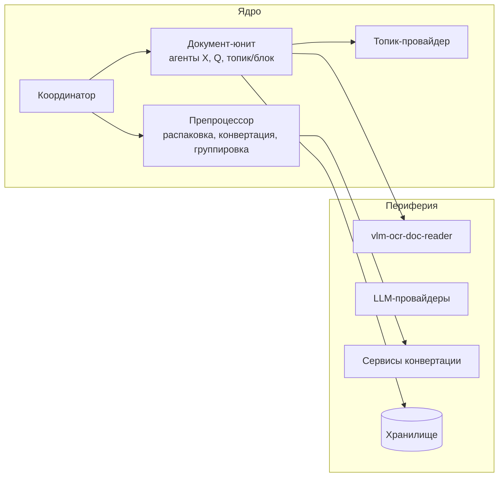

# Agentic Document Processing System (ADPS)
## Архитектура: Обзор

**Версия:** 0.1
**Дата:** 2026-02-11
**Статус:** Проектирование

---

## Краткое описание

ADPS — система для интеллектуальной обработки документов с использованием иерархии LLM-агентов.

### Ключевые возможности

- **Приём и нормализация** архивов с документами (DOCX → PDF конвертация)
- **Структурный анализ** документов через vlm-ocr-doc-reader
- **Тематический разбор** с формированием навигационной матрицы
- **Агентская модель** для ответов на вопросы по документам
- **Итеративный анализ** через MCP-протокол

### Контексты использования

| Контекст | Описание |
|----------|----------|
| Локальный модуль | Встраиваемый компонент для обработки документов |
| MCP-сервер | Сервер Model Context Protocol для интеграции с MCP-клиентами |
| Встраиваемый модуль | Библиотека для интеграции в другие системы |

---

## Архитектурная документация

Архитектура описана в документах, организованных по уровням абстракции:

| Документ | Описание | Для кого |
|----------|----------|----------|
| [Концептуальная модель](ADPS_Conceptual_Model.md) | Базовые понятия, агентская модель, навигация, выписки | Все |
| [Уровень 1: Контексты и пайплайн](ADPS_Architecture_L1.md) | Контексты использования, 7 этапов обработки, ядро/периферия | Архитекторы, Product |
| [Уровень 2: Компоненты](ADPS_Architecture_L2.md) | Координатор, Препроцессор, Документ-юнит, Топик-провайдер | Архитекторы, разработчики |
| [Уровень 3: Сквозные сценарии](ADPS_Architecture_L3.md) | Сценарии A/B/C/D, агенты X/Q/topic/block, фазы обработки | Разработчики, аналитики |
| [Уровень 4: Модель данных](ADPS_Architecture_L4.md) | Структуры данных: Block, Topic, Matrix, Extract, AgentState | Разработчики, DevOps |
| [Этапы реализации](ADPS_Implementation_Phases.md) | 4 этапа: препроцессинг, структура, тематика, ответы | Tech Lead, разработчики |
| [Подробный обзор и словарь](ADPS_Architecture_Overview.md) | Эволюция терминологии, сводная таблица терминов, рекомендации | Все |

> **Рекомендация:** Начните знакомство с [L1](ADPS_Architecture_L1.md), затем переходите к интересующему уровню детализации.

---

## Ключевые компоненты



| Компонент | Описание |
|-----------|----------|
| **Координатор** | Точка входа, оркестрация обработки |
| **Препроцессор** | Распаковка архивов, конвертация DOCX → PDF, группировка файлов |
| **Документ-юнит** | Агрегация файлов документа, хранение артефактов, обработка запросов |
| **Топик-провайдер** | Опциональный модуль, поставляющий темы для разбора |
| **Агенты** | X (структура), Q (запросы), топик-агенты, блок-агенты |

---

## Пайплайн обработки

```
1. Приём          → получение архивов, опционально вопроса
2. Нормализация   → приведение файлов к PDF
3. Группировка    → определение принадлежности файлов к документам
4. Извлечение    → обработка через vlm-ocr-doc-reader
5. Структура      → DAG блоков, оглавление
6. Тематический   → выделение тем, навигационная матрица, выписки
7. Запросы        → формирование ответов агентами
```

Подробнее: [L1: Пайплайн](ADPS_Architecture_L1.md#6-этапы-обработки)

---

## Сквозные сценарии

| Сценарий | Описание | Статус |
|----------|----------|--------|
| **A** | Первичная обработка с вопросом | ✅ MVP |
| **B** | Повторный запрос к обработанному документу | ✅ MVP |
| **C** | Обработка без вопроса (подготовка документа) | ✅ MVP |
| **D** | MCP-сессия (итеративный анализ) | ⏳ Бэклог |

Подробнее: [L3: Сценарии](ADPS_Architecture_L3.md)

---

## Важная терминология

⚠️ **Внимание:** Архитектура развивалась итеративно, поэтому термины в разных документах могут различаться.

### Ключевые изменения

| Устаревший термин | Актуальный термин | Где встречается |
|-------------------|-------------------|-----------------|
| Определитель тем | **Топик-провайдер** | L2 |
| Документ | **Документ-юнит** | L2 |
| контент-агент | Агент X, Q, топик-агент, блок-агент | Conceptual, L1-L2 |

**Полный словарь и пояснения:** см. [ADPS_Architecture_Overview.md](ADPS_Architecture_Overview.md#2-эволюция-терминологии)

---

## Архитектурные решения (ADR)

Решения по ключевым вопросам архитектуры оформляются как ADR:

| ID | Тема | Статус |
|----|-------|--------|
| — | — | — |

(будут добавляться по мере проектирования)

---

## Открытые вопросы

| # | Вопрос | Статус |
|---|--------|--------|
| 1 | Формат выписки: структура, ограничения на размер | Открыто |
| 2 | Мультидокументный запрос: кто координирует агрегацию? | Открыто |
| 3 | Обработка ошибок: недоступность LLM, конвертации, таймауты | Требует проработки |
| 4 | История агента Q: полная, без истории, заметки? | Открыто |
| 5 | Конкурентный разбор: повторный запрос во время фонового | Бэклог |

Подробнее: [L3: Открытые вопросы](ADPS_Architecture_L3.md#14-открытые-вопросы)

---

## История изменений

| Дата | Версия | Изменение |
|------|--------|-----------|
| 2026-02-11 | 0.1 | Создан entry point для архитектуры |
| 2026-02-11 | 0.2 | Добавлен документ с этапами реализации |
